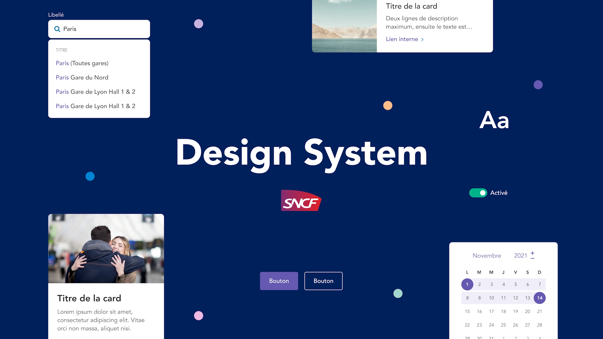

<a href="https://wcs.dev.sncf" target="blank">
    
</a>

# Web Components SNCF

[](https://img.shields.io/gitlab/pipeline-status/SNCF%2Fwcs?branch=master&style=for-the-badge)
[](https://img.shields.io/gitlab/v/tag/13813721?color=success&label=release&style=for-the-badge)
[](https://img.shields.io/npm/dt/wcs-core?style=for-the-badge)

[](https://stenciljs.com)
[](https://storybook.js.org/)

### **OFFICIAL DOCUMENTATION** 👉 [WCS.DEV.SNCF](https://wcs.dev.sncf)

This project is the web component implementation of the [SNCF design system](https://designmetier-bootstrap.sncf.fr/).  
It is built using  [Stencil](https://github.com/ionic-team/stencil) and documented using [Storybook](https://storybook.js.org/).

If you read this documentation on GitHub, only the development branch is updated at the moment. We use the [GitLab project](https://gitlab.com/SNCF/wcs/) for WCS development and releases.

## Packages

Here is the list of published npm packages and their goal :

| Package       | Usage                                                        |                                                          Version                                                          |
|:--------------|:-------------------------------------------------------------|:-------------------------------------------------------------------------------------------------------------------------:|
| `wcs-core`    | Contains the web components compiled with StencilJS          |    [](https://www.npmjs.com/package/wcs-core)    |
| `wcs-angular` | Angular integrations (value accessors, types, bindings, ...) | [](https://www.npmjs.com/package/wcs-angular) |
| `wcs-formly`  | Angular Formly integration for WCS                           |  [](https://www.npmjs.com/package/wcs-formly)  |
| `wcs-react`   | React integration for WCS (types, bindings, ...)             |   [](https://www.npmjs.com/package/wcs-react)   |

## StackBlitz templates

We created 3 StackBlitz templates to help you test quickly without worrying about WCS configuration :

- WcsAngular + WcsFormly : https://stackblitz.com/edit/wcs-angular-template
- WcsReact : https://stackblitz.com/edit/wcs-react-template
- WcsCore only (Plain HTML) : https://stackblitz.com/edit/wcs-plain-html-template

## Roadmap

This project is still under heavy development.  
You can get a preview of what's planned for the following months in the [GitLab Milestones](https://gitlab.com/SNCF/wcs/-/milestones).

Consult the [changelog](https://wcs.dev.sncf/?path=/docs/documentation-changelog--documentation) to know what's going on. 

Major versions releases :
- **v0** 👉 Jul 2019
- **v1** 👉 Sep 2020
- **v2** 👉 Jun 2021
- **v3** 👉 Feb 2023
- **v4** 👉 Sep 2023

    
### Example usage

There are example projects under `example` folder for angular and react.

Step to start the example project :
```shell
# wcs-core build
npm install
npm run build
```
```shell
# angular build (use --watch option to watch files)
cd angular
npm install
ng build --project wcs-angular
ng build --project wcs-formly
# start angular example
cd ../example/angular
npm install
ng serve
```
```shell
# react build
cd react
npm install
npm run clean && npm run compile
# start react example
cd ../example/react
npm install
npm run start
```

If you have any question, don't hesitate to [fill an issue](https://gitlab.com/SNCF/wcs/-/issues/new).

### Install in your project

You can refer to the [official WCS documentation](https://wcs.dev.sncf/?path=/docs/documentation-integrations-framework-integrations--documentation)
to use the lib with Angular or React. For other, StencilJS offers many integrations with different JS frameworks.

You can refer to [their official documentation](https://stenciljs.com/docs/overview) to add WCS to your project.


## Contributing

### Bug, Feature request, etc...

Don't hesitate to [fill in an issue](https://gitlab.com/SNCF/wcs/-/issues/new) and we'll discuss about it.
If you want to contribute code, please fill in an issue first so we can handle it properly.

### Starting the project

```sh
git clone https://github.com/SNCFdevelopers/wcs.git
cd wcs
npm install
# To see all components
npm start
# To see only the component you're working on
npm start -- --filter select
```

### Test

The project uses stencil built-in facility for testing : https://stenciljs.com/docs/testing-overview.

We encourage doing TDD on functional components. To launch the tests suite simply launch :

```sh
npm run test:watch
# Or if you simply want to run them once
npm test
```

To launch a specific suite of tests you can simply launch
```sh
npm run test:e2e path_to_tests_file
# Example: you must be at the root of the project
npm run test:e2e src/components/tabs/tabs.e2e.ts
```

### License

[MIT](https://gitlab.com/SNCF/wcs/-/blob/master/LICENSE)