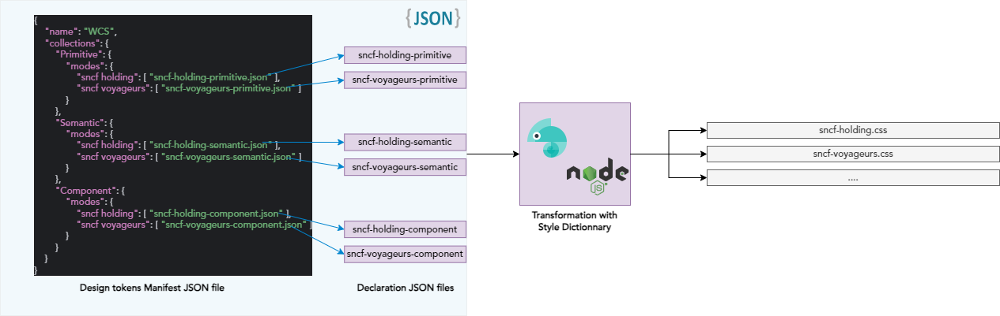

# Design tokens process principles
## Introduction

- We have a manifest JSON file which declares the layers and modes, each with their JSON mapping files.
- Each mode must describe a JSON file per layer to define the specific value for each variable.

Below is a diagram to help understand more :



## Examples
### Declaring a New Design Token

Depending on which layer you need to add the variable to, go to the related JSON files.

For example, if you have to add border-radius in the Semantic Layer, go into each JSON file related to that layer for every mode we have to add the tokens.

Assuming we have `sncf holding` and `sncf voyageurs` modes in our design tokens manifest for each layer:

```JSON
{
    ...
    "Semantic": {
        "modes": {
            "sncf holding": [
                "sncf-holding-semantic.json"
            ],
            "sncf voyageurs": [
                "sncf-voyageurs-semantic.json"
            ]
        }
    },
    ...
}
```

You need to edit both `sncf-holding-semantic.json` and `sncf-voyageurs-semantic.json` to add `border-radius`.

For SNCF Holding, we have 4px as the value (just an example). So we edit the existing SNCF Holding semantic JSON file to define the new semantic design token:

```JSON
{
    "semantic": {
      "border": {
          "radius": {
              "$type": "dimension",
              "$value": "{primitive.size.40}"
          }
      },
      "font": {
          ...
      }
    }
}
```

But for SNCF Voyageurs, we have 8px as the value :

```JSON
{
    "semantic": {
      "border": {
          "radius": {
              "$type": "dimension",
              "$value": "{primitive.size.80}"
          }
      },
      "font": {
          ...
      }
    }
}
```

When you finish, you have to run the `index.mjs` to transform the JSON Design Tokens into CSS (to test locally). So run, the WCS npm script 

```shell
npm run generate-design-tokens
```

If you use Storybook and you want to test your CSS after adding new token in JSON, you must run `build`
script to update the design tokens CSS in StoryBook dist

```shell
npm run build
```