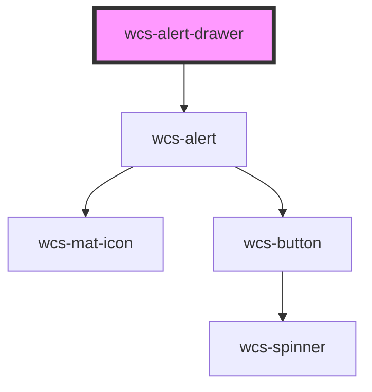

# alert-drawer


<!-- Auto Generated Below -->


## Overview

Serve as a container for displaying `wcs-alert` components. Directly use this component to display alerts in your applications.

## Usage

You can place the `wcs-alert-drawer` component anywhere in your application. It will be used to display alerts.
You need to set `position` property to define where the alert drawer will be displayed on the screen.

About alerts order:
- alerts are ordered up-bottom if the position is `top` and bottom-up if the position is `bottom`

## Accessibility guidelines 💡

- The component has `aria-live="polite"` and `aria-atomic="true"` attributes to announce the new alerts to screen readers

## Configuration (on the web component)

Per default, the `wcs-alert-drawer` is configured with:
- `position: 'top-right'`
- `showProgressBar: false`
- `timeout: 5000`

When using the `WcsAlertDrawer::show(alert: WcsAlertConfig)` method, you can override the default configuration by 
overriding it through the argument.
You can also set them in the `wcs-alert-drawer` component directly as attributes

```html
<wcs-alert-drawer position="top-right" show-progress-bar timeout="10000">
```
With this configuration, all alerts will be displayed with a progress bar and a timeout of 10 seconds.

## Properties

| Property          | Attribute           | Description                                         | Type                                                                                | Default          |
| ----------------- | ------------------- | --------------------------------------------------- | ----------------------------------------------------------------------------------- | ---------------- |
| `position`        | `position`          | Position of the alert drawer on the screen          | `"bottom" \| "bottom-left" \| "bottom-right" \| "top" \| "top-left" \| "top-right"` | `'bottom-right'` |
| `showProgressBar` | `show-progress-bar` | Whether to show the progress bar or not             | `boolean`                                                                           | `false`          |
| `timeout`         | `timeout`           | Timeout for the alert to be dismissed automatically | `number`                                                                            | `5000`           |


## Methods

### `clear() => Promise<void>`

Method exposed on `wcs-alert-drawer` to clear all `wcs-alert` which are inside, via the JS API

#### Returns

Type: `Promise<void>`


### `show(alert: WcsAlertConfig) => Promise<void>`

Method exposed on `wcs-alert-drawer` to show an alert programmatically via the JS API

#### Parameters

| Name    | Type                                                                                                        | Description       |
| ------- | ----------------------------------------------------------------------------------------------------------- | ----------------- |
| `alert` | `{ title: string; subtitle: string; intent: WcsAlertIntent; showProgressBar?: boolean; timeout?: number; }` | The alert to show |

#### Returns

Type: `Promise<void>`


## Slots

| Slot | Description                                                                  |
| ---- | ---------------------------------------------------------------------------- |
|      | the alert drawer content, where alerts you put as children will be displayed |


## Dependencies

### Depends on

- [wcs-alert](../alert)

### Graph


----------------------------------------------

*Built with [StencilJS](https://stenciljs.com/)*
