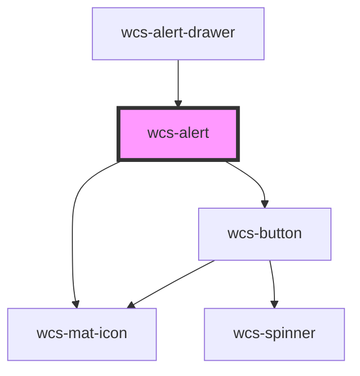

# wcs-alert

<!-- Auto Generated Below -->

## Overview

Alerts are used to communicate a state or an action that has been performed.
It has to be used conjunction with the `wcs-alert-drawer` component, or you can use it independently by taking care of
the alert visibility

## Properties

| Property          | Attribute           | Description                                                                                                                                                                                                                                                                                                                                                                                                                                                                                                                                                  | Type                                                 | Default     |
| ----------------- | ------------------- | ------------------------------------------------------------------------------------------------------------------------------------------------------------------------------------------------------------------------------------------------------------------------------------------------------------------------------------------------------------------------------------------------------------------------------------------------------------------------------------------------------------------------------------------------------------ | ---------------------------------------------------- | ----------- |
| `intent`          | `intent`            |                                                                                                                                                                                                                                                                                                                                                                                                                                                                                                                                                              | `"error" \| "information" \| "success" \| "warning"` | `'success'` |
| `show`            | `show`              | Controls the visibility state of the alert. This property is exposed to allow control of the alert's display state and animation timing: - Used by wcs-alert-drawer to coordinate exit animations when the alert is dismissed - Can be used directly for custom implementations (though using wcs-alert-drawer is recommended) - When set to false, it triggers the exit animation if implemented  Note: While direct usage is possible for custom implementations, it's recommended to use wcs-alert-drawer for consistent alert management and animations. | `boolean`                                            | `true`      |
| `showProgressBar` | `show-progress-bar` |                                                                                                                                                                                                                                                                                                                                                                                                                                                                                                                                                              | `boolean`                                            | `false`     |
| `timeout`         | `timeout`           | Time duration of the alert visibility  5000ms by default If 0, the alert will not emit `wcsAlertDismiss` event automatically                                                                                                                                                                                                                                                                                                                                                                                                                                 | `number`                                             | `5000`      |

## Events

| Event             | Description                               | Type                |
| ----------------- | ----------------------------------------- | ------------------- |
| `wcsAlertDismiss` | Event emitted when the alert is dismissed | `CustomEvent<void>` |

## Dependencies

### Used by

 - [wcs-alert-drawer](../alert-drawer)

### Depends on

- [wcs-mat-icon](../mat-icon)
- [wcs-button](../button)

### Graph

----------------------------------------------

*Built with [StencilJS](https://stenciljs.com/)*
