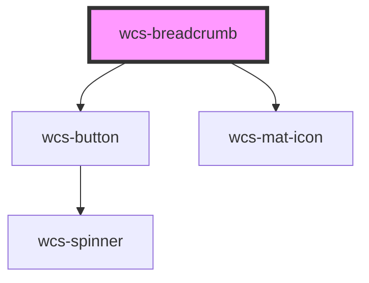

# wcs-breadcrumb

<!-- Auto Generated Below -->

## Overview

A breadcrumb trail consists of a list of links to the parent pages of the current page in hierarchical order.  
It helps users find their place within a website or web application. Breadcrumbs are often placed horizontally before a page's main content.

## Accessibility guidelines 💡
> - If the last item is a link to the current page, you must set the `aria-current` attribute to `page`.
> - If the element representing the current page is not a link, `aria-current` is optional.
> - The **aria attributes** you set on `wcs-breadcrumb` are passed to the native `nav` element located inside its shadow DOM.
> - You can set the attributes : `aria-label`, `aria-labelledby` and `role`. By default, `aria-label` is set to `Breadcrumb`.

## Properties

| Property                | Attribute                  | Description                                                                                                                                                                          | Type     | Default                       |
| ----------------------- | -------------------------- | ------------------------------------------------------------------------------------------------------------------------------------------------------------------------------------ | -------- | ----------------------------- |
| `ariaLabelExpandButton` | `aria-label-expand-button` | Set `aria-label` for the expand button when the breadcrumb is collapsed.                                                                                                             | `string` | `'Show all breadcrumb items'` |
| `itemsAfterCollapse`    | `items-after-collapse`     | The number of breadcrumb items to show after the expand button. If `itemsBeforeCollapse` + `itemsAfterCollapse` is greater than `maxItems`, the breadcrumb will not be collapsed.    | `number` | `2`                           |
| `itemsBeforeCollapse`   | `items-before-collapse`    | The number of breadcrumb items to show before the expand button. If `itemsBeforeCollapse` + `itemsAfterCollapse` is greater than `maxItems`, the breadcrumb will not be collapsed.   | `number` | `1`                           |
| `maxItems`              | `max-items`                | If the number of breadcrumb items exceeds this maximum, the breadcrumb will collapse and show an expand button.   If this prop is `undefined`, breadcrumb items will never collapse. | `number` | `undefined`                   |

## Dependencies

### Depends on

- [wcs-button](../button)
- [wcs-mat-icon](../mat-icon)

### Graph

----------------------------------------------

*Built with [StencilJS](https://stenciljs.com/)*
