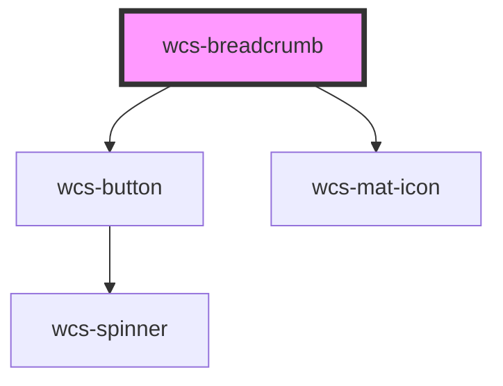

# wcs-breadcrumb


<!-- Auto Generated Below -->


## Overview

A breadcrumb trail consists of a list of links to the parent pages of the current page in hierarchical order.  
It helps users find their place within a website or web application. Breadcrumbs are often placed horizontally before a page's main content.

## Accessibility guidelines 💡
> - If the last item is a link to the current page, you must set the `aria-current` attribute to `page` on `wcs-breadcrumb-item`.
> - If the element representing the current page is not a link, `aria-current` is optional.
> - You can set the attribute `aria-label` on `wcs-breadcrumb`, it will be passed to the native `nav` element located inside its shadow DOM. 
>   You can find the `aria-label` default value in the table below. If your application is in English, you can set it to `Breadcrumb`.
> - You can do the same thing for the `aria-label` of the expand button when the breadcrumb is collapsed. You can find its default value
>   in the table below too.  
> - If you need to **dynamically change the `aria-label` attribute of `wcs-breadcrumb` after the first render**, you can use the 
>   `setAriaAttribute` JS method (example below). For the expand button however, you can update the prop `ariaLabelExpandButton`.  
>   Note: we're working on updating the component automatically when attributes change. 

> ```javascript
> const wcsButton = document.querySelector('wcs-button');
> await wcsButton.setAriaAttribute('aria-label', 'new label');
> ```

## Properties

| Property                | Attribute                  | Description                                                                                                                                                                          | Type     | Default                         |
| ----------------------- | -------------------------- | ------------------------------------------------------------------------------------------------------------------------------------------------------------------------------------ | -------- | ------------------------------- |
| `ariaLabelExpandButton` | `aria-label-expand-button` | Set `aria-label` for the expand button when the breadcrumb is collapsed.                                                                                                             | `string` | `EXPAND_BTN_ARIA_LABEL_DEFAULT` |
| `itemsAfterCollapse`    | `items-after-collapse`     | The number of breadcrumb items to show after the expand button. If `itemsBeforeCollapse` + `itemsAfterCollapse` is greater than `maxItems`, the breadcrumb will not be collapsed.    | `number` | `2`                             |
| `itemsBeforeCollapse`   | `items-before-collapse`    | The number of breadcrumb items to show before the expand button. If `itemsBeforeCollapse` + `itemsAfterCollapse` is greater than `maxItems`, the breadcrumb will not be collapsed.   | `number` | `1`                             |
| `maxItems`              | `max-items`                | If the number of breadcrumb items exceeds this maximum, the breadcrumb will collapse and show an expand button.   If this prop is `undefined`, breadcrumb items will never collapse. | `number` | `undefined`                     |


## Methods

### `setAriaAttribute(attr: AriaAttributeName, value: string | null | undefined) => Promise<void>`


#### Parameters

| Name    | Type                         | Description |
| ------- | ---------------------------- | ----------- |
| `attr`  | `"role" \| `aria-${string}`` |             |
| `value` | `string`                     |             |

#### Returns

Type: `Promise<void>`


## Dependencies

### Depends on

- [wcs-button](../button)
- [wcs-mat-icon](../mat-icon)

### Graph


----------------------------------------------

*Built with [StencilJS](https://stenciljs.com/)*
