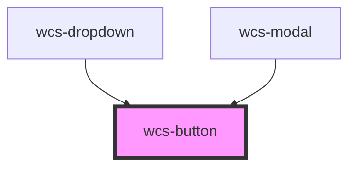

# Button


### Basic

```html
<wcs-button class="wcs-primary">Primary</wcs-button>
<wcs-button class="wcs-secondary">Secondary</wcs-button>
<wcs-button class="wcs-success">Success</wcs-button>
<wcs-button class="wcs-warning">Warning</wcs-button>
<wcs-button class="wcs-danger">Danger</wcs-button>
<wcs-button class="wcs-info">Info</wcs-button>
<wcs-button class="wcs-dark">Dark</wcs-button>
<wcs-button class="wcs-light">Light</wcs-button>
<wcs-button class="wcs-primary" disabled>Disabled</wcs-button>
```

### Clear

```html
<wcs-button mode="clear" class="wcs-primary">Primary</wcs-button>
<wcs-button mode="clear" class="wcs-secondary">Secondary</wcs-button>
<wcs-button mode="clear" class="wcs-success">Success</wcs-button>
<wcs-button mode="clear" class="wcs-warning">Warning</wcs-button>
<wcs-button mode="clear" class="wcs-danger">Danger</wcs-button>
<wcs-button mode="clear" class="wcs-info">Info</wcs-button>
<wcs-button mode="clear" class="wcs-dark">Dark</wcs-button>
<wcs-button mode="clear" class="wcs-primary" disabled>Disabled</wcs-button>
```

### Stroked

```html
<wcs-button mode="stroked" class="wcs-primary">Primary</wcs-button>
<wcs-button mode="stroked" class="wcs-secondary">Secondary</wcs-button>
<wcs-button mode="stroked" class="wcs-success">Success</wcs-button>
<wcs-button mode="stroked" class="wcs-warning">Warning</wcs-button>
<wcs-button mode="stroked" class="wcs-danger">Danger</wcs-button>
<wcs-button mode="stroked" class="wcs-info">Info</wcs-button>
<wcs-button mode="stroked" class="wcs-dark">Dark</wcs-button>
<wcs-button mode="stroked" class="wcs-primary" disabled>Disabled</wcs-button>
```
### Square

```html
<wcs-button shape="square" class="wcs-primary">
    <i class="material-icons">accessibility_new</i>
</wcs-button>
<wcs-button shape="square" mode="clear" class="wcs-primary">
    <i class="material-icons">accessibility_new</i>
</wcs-button>
<wcs-button shape="square" mode="stroked" class="wcs-primary">
    <i class="material-icons">accessibility_new</i>
</wcs-button>
<wcs-button shape="square" class="wcs-primary" disabled>
    <i class="material-icons">accessibility_new</i>
</wcs-button>
```

### Round

```html
<wcs-button shape="round" class="wcs-primary">
    <i class="material-icons">accessibility_new</i>
</wcs-button>
<wcs-button shape="round" mode="clear" class="wcs-primary">
    <i class="material-icons">accessibility_new</i>
</wcs-button>
<wcs-button shape="round" mode="stroked" class="wcs-primary">
    <i class="material-icons">accessibility_new</i>
</wcs-button>
<wcs-button shape="round" class="wcs-primary" disabled>
    <i class="material-icons">accessibility_new</i>
</wcs-button>
```

### Link

```html
<wcs-button class="wcs-primary" href="#">Un lien !</wcs-button>
```

### Small

```html
<wcs-button class="wcs-primary" shape="small">Small</wcs-button>
<wcs-button class="wcs-primary" mode="clear" shape="small">Small</wcs-button>
<wcs-button class="wcs-primary" mode="stroked" shape="small">Small</wcs-button>
<wcs-button class="wcs-primary" stroked disabled shape="small">Disabled</wcs-button>
```

<!-- Auto Generated Below -->


## Properties

| Property   | Attribute  | Description                                                         | Type                                         | Default     |
| ---------- | ---------- | ------------------------------------------------------------------- | -------------------------------------------- | ----------- |
| `disabled` | `disabled` | Specify wether the button is disabled or not.                       | `boolean`                                    | `false`     |
| `href`     | `href`     | Set a URL to point to. If specified use a `a` tag instead of `btn`. | `string`                                     | `undefined` |
| `mode`     | `mode`     | This attribute specify the appearance of the button.                | `"clear" \| "plain" \| "stroked"`            | `'plain'`   |
| `ripple`   | `ripple`   | Specify wether the button should have a ripple effect or not.       | `boolean`                                    | `true`      |
| `shape`    | `shape`    | Specify the shape of the button.                                    | `"normal" \| "round" \| "small" \| "square"` | `'normal'`  |
| `type`     | `type`     | Specify the button type.                                            | `"button" \| "submit"`                       | `'button'`  |


## Dependencies

### Used by

 - [wcs-dropdown](../dropdown)
 - [wcs-modal](../modal)

### Graph


----------------------------------------------

*Built with [StencilJS](https://stenciljs.com/)*
