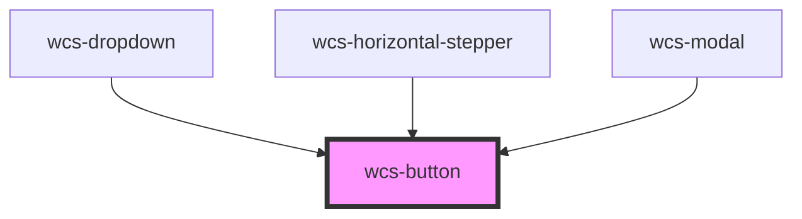

# Button

<!-- Auto Generated Below -->

## Properties

| Property   | Attribute  | Description                                                         | Type                                         | Default     |
| ---------- | ---------- | ------------------------------------------------------------------- | -------------------------------------------- | ----------- |
| `disabled` | `disabled` | Specify wether the button is disabled or not.                       | `boolean`                                    | `false`     |
| `href`     | `href`     | Set a URL to point to. If specified use a `a` tag instead of `btn`. | `string`                                     | `undefined` |
| `mode`     | `mode`     | This attribute specify the appearance of the button.                | `"clear" \| "plain" \| "stroked"`            | `'plain'`   |
| `ripple`   | `ripple`   | Specify wether the button should have a ripple effect or not.       | `boolean`                                    | `true`      |
| `shape`    | `shape`    | Specify the shape of the button.                                    | `"normal" \| "round" \| "small" \| "square"` | `'normal'`  |
| `type`     | `type`     | Specify the button type.                                            | `"button" \| "submit"`                       | `'button'`  |

## Dependencies

### Used by

 - [wcs-dropdown](../dropdown)
 - [wcs-horizontal-stepper](../horizontal-stepper)
 - [wcs-modal](../modal)

### Graph

----------------------------------------------

*Built with [StencilJS](https://stenciljs.com/)*
