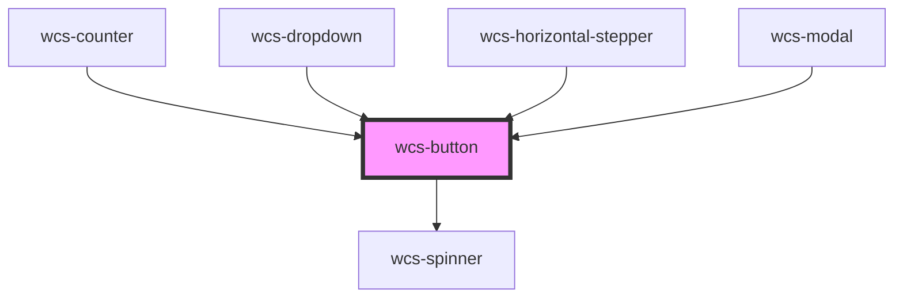

# Button

<!-- Auto Generated Below -->

## Overview

Button component, can also be a link when specifying href.

## Properties

| Property   | Attribute  | Description                                                                                                                                                         | Type                              | Default     |
| ---------- | ---------- | ------------------------------------------------------------------------------------------------------------------------------------------------------------------- | --------------------------------- | ----------- |
| `disabled` | `disabled` | Specify whether the button is disabled or not.                                                                                                                      | `boolean`                         | `false`     |
| `href`     | `href`     | Set a URL to point to.  If specified use a `a` tag instead of `btn`.                                                                                            | `string`                          | `undefined` |
| `loading`  | `loading`  | Flag to display spinner until the end of action                                                                                                                     | `boolean`                         | `false`     |
| `mode`     | `mode`     | This attribute specify the appearance of the button.                                                                                                                | `"clear" \| "plain" \| "stroked"` | `'plain'`   |
| `ripple`   | `ripple`   | Specify whether the button should have a ripple effect or not.                                                                                                      | `boolean`                         | `true`      |
| `shape`    | `shape`    | Specify the shape of the button.                                                                                                                                    | `"normal" \| "round" \| "square"` | `'normal'`  |
| `size`     | `size`     | Specify the size of the button.                                                                                                                                     | `"l" \| "m" \| "s"`               | `'m'`       |
| `target`   | `target`   | Specifies where to open the linked document when using href (see prop above)  Default '_self' will open the linked document in the same frame as it was clicked | `"_blank" \| "_self"`             | `undefined` |
| `type`     | `type`     | Specify the button type.                                                                                                                                            | `"button" \| "submit"`            | `'button'`  |

## Dependencies

### Used by

 - [wcs-counter](../counter)
 - [wcs-dropdown](../dropdown)
 - [wcs-horizontal-stepper](../horizontal-stepper)
 - [wcs-modal](../modal)

### Depends on

- [wcs-spinner](../spinner)

### Graph

----------------------------------------------

*Built with [StencilJS](https://stenciljs.com/)*
