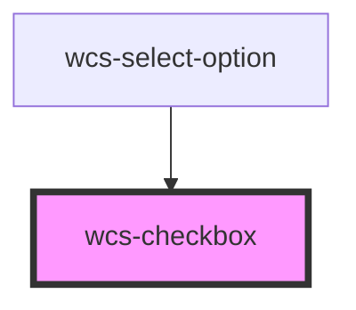

# Checkbox

```html
<wcs-checkbox>Normal checkbox</wcs-checkbox>
<wcs-checkbox checked="true">Default checked checkbox</wcs-checkbox>
<wcs-checkbox>Checkbox</wcs-checkbox>
<wcs-checkbox indeterminate="true">Checkbox indeterminate</wcs-checkbox>
```

<!-- Auto Generated Below -->


## Properties

| Property        | Attribute       | Description                                       | Type      | Default           |
| --------------- | --------------- | ------------------------------------------------- | --------- | ----------------- |
| `checked`       | `checked`       | If `true`, the checkbox is selected.              | `boolean` | `false`           |
| `indeterminate` | `indeterminate` | If `true` the checkbox is in indeterminate state. | `boolean` | `false`           |
| `name`          | `name`          |                                                   | `string`  | `this.checkboxId` |


## Events

| Event       | Description                                    | Type                                     |
| ----------- | ---------------------------------------------- | ---------------------------------------- |
| `wcsChange` | Emitted when the checked property has changed. | `CustomEvent<CheckboxChangeEventDetail>` |


## Dependencies

### Used by

 - [wcs-select-option](../select-option)

### Graph


----------------------------------------------

*Built with [StencilJS](https://stenciljs.com/)*
