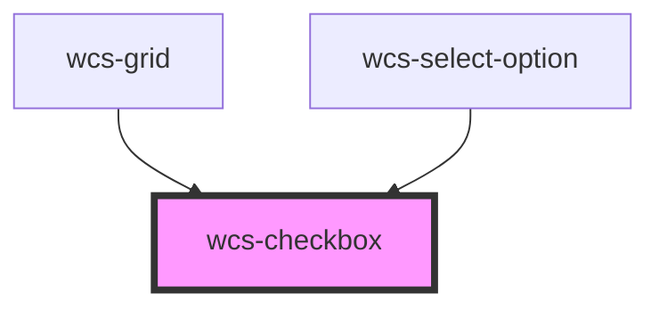

# Checkbox

<!-- Auto Generated Below -->

## Properties

| Property         | Attribute         | Description                                                   | Type                            | Default           |
| ---------------- | ----------------- | ------------------------------------------------------------- | ------------------------------- | ----------------- |
| `checked`        | `checked`         | If `true`, the checkbox is selected.                          | `boolean`                       | `false`           |
| `disabled`       | `disabled`        | Specify wether the checkbox is disabled or not.               | `boolean`                       | `false`           |
| `indeterminate`  | `indeterminate`   | If `true` the checkbox is in indeterminate state.             | `boolean`                       | `false`           |
| `labelAlignment` | `label-alignment` | Specifie the alignment of the checkbox with the label content | `"bottom" \| "center" \| "top"` | `'center'`        |
| `name`           | `name`            |                                                               | `string`                        | `this.checkboxId` |

## Events

| Event       | Description                                    | Type                                     |
| ----------- | ---------------------------------------------- | ---------------------------------------- |
| `wcsChange` | Emitted when the checked property has changed. | `CustomEvent<CheckboxChangeEventDetail>` |

## Dependencies

### Used by

 - [wcs-grid](../grid)
 - [wcs-select-option](../select-option)

### Graph

----------------------------------------------

*Built with [StencilJS](https://stenciljs.com/)*
