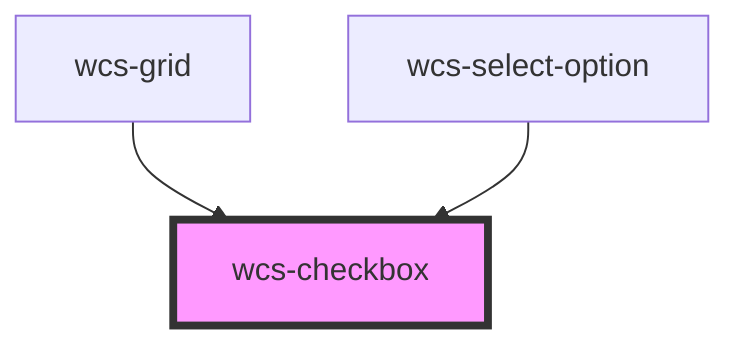

# Checkbox

```html
<wcs-checkbox style="margin: 16px 0px;">Normal checkbox</wcs-checkbox>
<wcs-checkbox style="margin: 16px 0px;" checked="true">Default checked checkbox</wcs-checkbox>
<wcs-checkbox style="margin: 16px 0px;">Checkbox</wcs-checkbox>
<wcs-checkbox style="margin: 16px 0px;" indeterminate="true">Checkbox indeterminate</wcs-checkbox>
```

## Custom label alignment
```html
<wcs-checkbox style="margin: 16px 0px;" label-alignment="top">Multiline<br /><small>lorem ipsum dolor sit amet consectetuer adipiscing elit</small></wcs-checkbox>
<wcs-checkbox style="margin: 16px 0px;" label-alignment="top">Multiline<br /><small>lorem ipsum dolor sit amet consectetuer adipiscing elit<br/>Web Component SNCF</small></wcs-checkbox>
<wcs-checkbox style="margin: 16px 0px;" label-alignment="center">Multiline<br /><small>lorem ipsum dolor sit amet consectetuer adipiscing elit<br/>Web Component SNCF</small></wcs-checkbox>
<wcs-checkbox style="margin: 16px 0px;" label-alignment="bottom">Multiline<br /><small>lorem ipsum dolor sit amet consectetuer adipiscing elit<br/>Web Component SNCF</small></wcs-checkbox>
```

<!-- Auto Generated Below -->


## Properties

| Property         | Attribute         | Description                                                   | Type                            | Default           |
| ---------------- | ----------------- | ------------------------------------------------------------- | ------------------------------- | ----------------- |
| `checked`        | `checked`         | If `true`, the checkbox is selected.                          | `boolean`                       | `false`           |
| `indeterminate`  | `indeterminate`   | If `true` the checkbox is in indeterminate state.             | `boolean`                       | `false`           |
| `labelAlignment` | `label-alignment` | Specifie the alignment of the checkbox with the label content | `"bottom" \| "center" \| "top"` | `'center'`        |
| `name`           | `name`            |                                                               | `string`                        | `this.checkboxId` |


## Events

| Event       | Description                                    | Type                                     |
| ----------- | ---------------------------------------------- | ---------------------------------------- |
| `wcsChange` | Emitted when the checked property has changed. | `CustomEvent<CheckboxChangeEventDetail>` |


## Dependencies

### Used by

 - [wcs-grid](../grid)
 - [wcs-select-option](../select-option)

### Graph


----------------------------------------------

*Built with [StencilJS](https://stenciljs.com/)*
