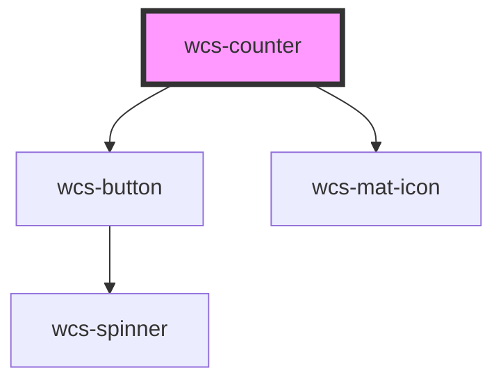

# Input

<!-- Auto Generated Below -->

## Overview

Counter component, meant to be used for small range of values (e.g : 0 - 5). 
For larger or specific ranges, please use <a href=".?path=/docs/components-input--documentation">wcs-input (type number)</a>

## Properties

| Property             | Attribute | Description                                                                                                           | Type         | Default     |
| -------------------- | --------- | --------------------------------------------------------------------------------------------------------------------- | ------------ | ----------- |
| `label` _(required)_ | `label`   | The label of the counter.  e.g. Number of passengers, train carriages, railroad tracks...                         | `string`     | `undefined` |
| `max`                | `max`     | The maximum value of the counter. If the value of the max attribute isn't set, then the element has no maximum value. | `number`     | `undefined` |
| `min`                | `min`     | The minimum value of the counter. If the value of the min attribute isn't set, then the element has no minimum value. | `number`     | `undefined` |
| `size`               | `size`    | Specify the size (height) of the counter.                                                                             | `"l" \| "m"` | `'m'`       |
| `step`               | `step`    | Defines by how much the counter will be incremented or decremented.                                                   | `number`     | `1`         |
| `value`              | `value`   | Allow to change currentValue programmatically                                                                         | `number`     | `undefined` |

## Events

| Event       | Description                                        | Type                                    |
| ----------- | -------------------------------------------------- | --------------------------------------- |
| `wcsChange` | Emitted when the value of the counter has changed. | `CustomEvent<CounterChangeEventDetail>` |

## Dependencies

### Depends on

- [wcs-button](../button)
- [wcs-mat-icon](../mat-icon)

### Graph

----------------------------------------------

*Built with [StencilJS](https://stenciljs.com/)*
