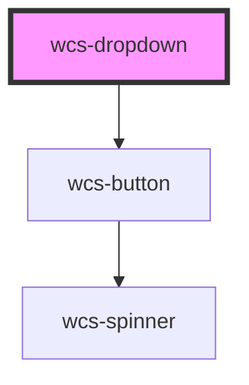

# Dropdown

<!-- Auto Generated Below -->

## Overview

The dropdown component use a wcs-button under the hood, so you can use the same css classes as the button to style the
dropdown.

## Properties

| Property    | Attribute   | Description                                               | Type                                                                                                                                                                                                         | Default        |
| ----------- | ----------- | --------------------------------------------------------- | ------------------------------------------------------------------------------------------------------------------------------------------------------------------------------------------------------------ | -------------- |
| `disabled`  | `disabled`  | Specifies whether the dropdown button is clickable or not | `boolean`                                                                                                                                                                                                    | `false`        |
| `mode`      | `mode`      | Dropdown's button mode                                    | `"clear" \| "plain" \| "stroked"`                                                                                                                                                                            | `'stroked'`    |
| `noArrow`   | `no-arrow`  | Hides the arrow in the button                             | `boolean`                                                                                                                                                                                                    | `false`        |
| `placement` | `placement` | placement of the dropdown's popover                       | `"auto" \| "auto-end" \| "auto-start" \| "bottom" \| "bottom-end" \| "bottom-start" \| "left" \| "left-end" \| "left-start" \| "right" \| "right-end" \| "right-start" \| "top" \| "top-end" \| "top-start"` | `'bottom-end'` |
| `shape`     | `shape`     | Dropdown's button shape                                   | `"normal" \| "round" \| "square"`                                                                                                                                                                            | `'normal'`     |
| `size`      | `size`      | Dropdown's button size                                    | `"l" \| "m" \| "s"`                                                                                                                                                                                          | `'m'`          |

## Slots

| Slot            | Description                                                 |
| --------------- | ----------------------------------------------------------- |
| `"item"`        | The slot container the list of `wcs-dropdown-item` elements |
| `"placeholder"` | The slot containing the placeholder displayed in button     |

## Dependencies

### Depends on

- [wcs-button](../button)

### Graph

----------------------------------------------

*Built with [StencilJS](https://stenciljs.com/)*
