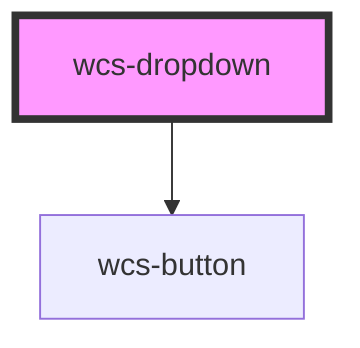

# Dropdown

The dropdown component use a wcs-button under the hood, so you can use the same css classes as the button to style the 
dropdown.

## Classic

```html
<wcs-dropdown class="wcs-primary">
    <div slot="placeholder">Dropdown</div>
    <wcs-dropdown-item>Un</wcs-dropdown-item>
    <wcs-dropdown-item>Deux</wcs-dropdown-item>
    <wcs-dropdown-item>Trois</wcs-dropdown-item>
</wcs-dropdown>
```

## Plain button

```html
<wcs-dropdown class="wcs-primary" mode="plain">
    <div slot="placeholder">Dropdown</div>
    <wcs-dropdown-item>Action</wcs-dropdown-item>
    <wcs-dropdown-item>Deuxième action</wcs-dropdown-item>
    <wcs-dropdown-item>Troisième action avec un long titre</wcs-dropdown-item>
</wcs-dropdown>
```

## Small

```html
<wcs-dropdown class="wcs-primary" shape="small">
    <div slot="placeholder">Dropdown</div>
    <wcs-dropdown-item>Un</wcs-dropdown-item>
    <wcs-dropdown-item>Deux</wcs-dropdown-item>
    <wcs-dropdown-item>Trois</wcs-dropdown-item>
</wcs-dropdown>
```

<!-- Auto Generated Below -->


## Properties

| Property   | Attribute  | Description | Type                                         | Default     |
| ---------- | ---------- | ----------- | -------------------------------------------- | ----------- |
| `disabled` | `disabled` |             | `boolean`                                    | `false`     |
| `mode`     | `mode`     |             | `"clear" \| "plain" \| "stroked"`            | `'stroked'` |
| `shape`    | `shape`    |             | `"normal" \| "round" \| "small" \| "square"` | `'normal'`  |


## Dependencies

### Depends on

- [wcs-button](../button)

### Graph


----------------------------------------------

*Built with [StencilJS](https://stenciljs.com/)*
