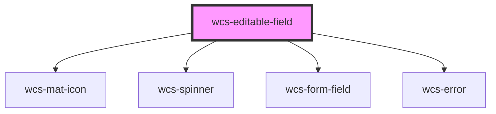

# Editable fields

<!-- Auto Generated Below -->

## Properties

| Property             | Attribute   | Description                                                        | Type                                | Default     |
| -------------------- | ----------- | ------------------------------------------------------------------ | ----------------------------------- | ----------- |
| `errorMsg`           | `error-msg` | Error message displayed under the field if validation failed.      | `string`                            | `null`      |
| `formatFn`           | --          | Function used to format the value                                  | `(value: any) => string`            | `undefined` |
| `label` _(required)_ | `label`     | Label of the field                                                 | `string`                            | `undefined` |
| `readonly`           | `readonly`  | Specify whether the field is editable or not                       | `boolean`                           | `false`     |
| `size`               | `size`      | Specify the size (height) of the editable field.                   | `"l" \| "m"`                        | `'m'`       |
| `type`               | `type`      | Specifies which component is used for editing                      | `"input" \| "select" \| "textarea"` | `'input'`   |
| `validateFn`         | --          | Function to customize the validation of the data during the update | `(value: any) => boolean`           | `undefined` |
| `value`              | `value`     | Initial value of the field                                         | `any`                               | `undefined` |

## Events

| Event       | Description                                       | Type                                        |
| ----------- | ------------------------------------------------- | ------------------------------------------- |
| `wcsChange` | event called at each (valid) update of the field. | `CustomEvent<EditableComponentUpdateEvent>` |

## Dependencies

### Depends on

- [wcs-mat-icon](../mat-icon)
- [wcs-spinner](../spinner)
- [wcs-form-field](../form-field)
- [wcs-error](../error)

### Graph

----------------------------------------------

*Built with [StencilJS](https://stenciljs.com/)*
