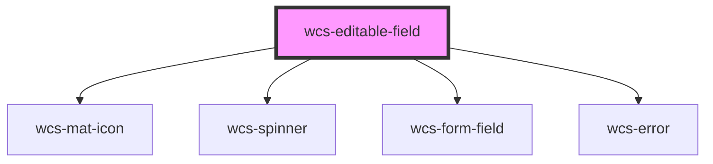

# Editable fields

<!-- Auto Generated Below -->

## Overview

The editable-field component can be used to simplify the user experience, avoiding the use of a redirection to a form
to edit the data of an entity. You can use it with these wrapped components : `wcs-input`, `wcs-textarea`, `wcs-select`. 

This component is not present in the SNCF design system specifications, so we tried to build it in the most
"discoverable" way possible (for users who interact with), but it's a first version.

**How to use ❓**  
This component is mostly used with a server that returns a response to the input sent through the `wcsChange` event.
It has 3 internal states :
- DISPLAY = the default state of the editable-field
- EDIT = the editable-field is editable, the user should input the data
- LOADING = the data is submitted and the editable-field is waiting for a **response**

A **response** is needed to get the component out of the LOADING state. You can either :
- Set the `value` property to a different value to tell the component to refresh and go back into DISPLAY state
- Use the `successHandler` callback through the `wcsChange` event (see interface [EditableComponentUpdateEvent](https://gitlab.com/SNCF/wcs/-/blob/develop/src/components/editable-field/editable-field-interface.tsx))
- Use the `errorHandler` callback through the `wcsChange` event (see interface [EditableComponentUpdateEvent](https://gitlab.com/SNCF/wcs/-/blob/develop/src/components/editable-field/editable-field-interface.tsx))

**Accessibility guidelines 💡**  

> - Aria attributes are put on the native component on the first rendering with the `label` and `errorMsg` you provided 
> - Additional aria attributes put on `<wcs-editable-field>` won't inherit onto the native component : you must use the `setAriaAttribute` method.

## Properties

| Property             | Attribute   | Description                                                        | Type                                | Default     |
| -------------------- | ----------- | ------------------------------------------------------------------ | ----------------------------------- | ----------- |
| `errorMsg`           | `error-msg` | Error message displayed under the field if validation failed.      | `string`                            | `null`      |
| `formatFn`           | --          | Function used to format the value                                  | `(value: any) => string`            | `undefined` |
| `label` _(required)_ | `label`     | Label of the field                                                 | `string`                            | `undefined` |
| `readonly`           | `readonly`  | Specify whether the field is editable or not                       | `boolean`                           | `false`     |
| `size`               | `size`      | Specify the size (height) of the editable field.                   | `"l" \| "m"`                        | `'m'`       |
| `type`               | `type`      | Specifies which component is used for editing                      | `"input" \| "select" \| "textarea"` | `'input'`   |
| `validateFn`         | --          | Function to customize the validation of the data during the update | `(value: any) => boolean`           | `undefined` |
| `value`              | `value`     | Initial value of the field                                         | `any`                               | `undefined` |

## Events

| Event       | Description                                       | Type                                        |
| ----------- | ------------------------------------------------- | ------------------------------------------- |
| `wcsChange` | Event called at each (valid) update of the field. | `CustomEvent<EditableComponentUpdateEvent>` |

## Dependencies

### Depends on

- [wcs-mat-icon](../mat-icon)
- [wcs-spinner](../spinner)
- [wcs-form-field](../form-field)
- [wcs-error](../error)

### Graph

----------------------------------------------

*Built with [StencilJS](https://stenciljs.com/)*
