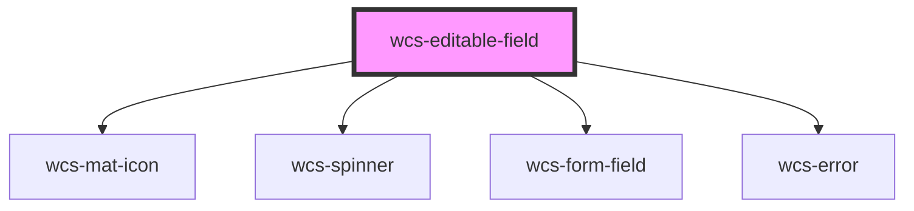

# Editable fields

Editable fields can be used to simplify the user experience. They avoid the use of a redirection to a form to edit the
data of an entity.

This component is not present in the SNCF design system specifications, so we tried to build it in the most
"discoverable" way possible (for users who interact with), but it's a first version.

## Basic usage

```html
<wcs-editable-field label="Nom du champ" value="Initial value" error-msg="SNCF doit apparaitre dans la valeur" id="editable-field-ex-1">
    <wcs-input id="test"></wcs-input>
</wcs-editable-field>

<script>
    let editableFieldEx1 = document.getElementById('editable-field-ex-1');
    editableFieldEx1.validateFn = (value) => value.includes('SNCF')
    editableFieldEx1.addEventListener('wcsChange', (event) => {
        setTimeout(() => {
            editableFieldEx1.value = event.detail.newValue;
        }, 1000);
    });
</script>
```

## With a textarea

```html
<wcs-editable-field type="textarea" label="Un autre champ" value="Initia" id="editable-field-ex-2">
    <wcs-textarea></wcs-textarea>
</wcs-editable-field>

<script>
    let editableFieldEx2 = document.getElementById('editable-field-ex-2');
    editableFieldEx2.addEventListener('wcsChange', (event) => {
        setTimeout(() => {
            event.detail.successHandler();
        }, 1000);
    });
</script>
```

## With a select

```html
<wcs-editable-field type="select" label="Un autre champ" value="1" id="editable-field-ex-3">
    <wcs-select placeholder="Le select">
        <wcs-select-option value="1">One</wcs-select-option>
        <wcs-select-option value="2">Two</wcs-select-option>
        <wcs-select-option value="3">Three</wcs-select-option>
    </wcs-select>
</wcs-editable-field>

<script>
    let editableFieldEx3 = document.getElementById('editable-field-ex-3');
    editableFieldEx3.addEventListener('wcsChange', (event) => {
        setTimeout(() => {
            editableFieldEx3.value = event.detail.newValue;
        }, 1000);
    });
</script>
```

## Readonly

If the readonly attribute is added, the component will not be editable and no interaction will be proposed.

```html
<wcs-editable-field label="Nom du champ" value="Initial value" readonly>
    <wcs-input></wcs-input>
</wcs-editable-field>
```


<!-- Auto Generated Below -->


## Properties

| Property             | Attribute   | Description                                                        | Type                                | Default     |
| -------------------- | ----------- | ------------------------------------------------------------------ | ----------------------------------- | ----------- |
| `errorMsg`           | `error-msg` | Error message displayed under the field if validation failed.      | `string`                            | `null`      |
| `formatFn`           | --          | Function used to format the value                                  | `(value: any) => string`            | `undefined` |
| `label` _(required)_ | `label`     | Label of the field                                                 | `string`                            | `undefined` |
| `readonly`           | `readonly`  | Specify whether the field is editable or not                       | `boolean`                           | `false`     |
| `type`               | `type`      | Specifies which component is used for editing                      | `"input" \| "select" \| "textarea"` | `'input'`   |
| `validateFn`         | --          | Function to customize the validation of the data during the update | `(value: any) => boolean`           | `undefined` |
| `value`              | `value`     | Initial value of the field                                         | `any`                               | `undefined` |


## Events

| Event       | Description                                       | Type                                        |
| ----------- | ------------------------------------------------- | ------------------------------------------- |
| `wcsChange` | event called at each (valid) update of the field. | `CustomEvent<EditableComponentUpdateEvent>` |


## Dependencies

### Depends on

- [wcs-mat-icon](../mat-icon)
- [wcs-spinner](../spinner)
- [wcs-form-field](../form-field)
- [wcs-error](../error)

### Graph


----------------------------------------------

*Built with [StencilJS](https://stenciljs.com/)*
