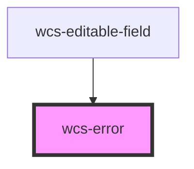

# wcs-error

<!-- Auto Generated Below -->

## Overview

The `wcs-error` should always be wrapped in a `wcs-form-field`.
It is used to display a red message under the field indicating an incorrect user input.

## Accessibility guidelines 💡
- Provide a relevant error message to inform the users what they should change to make the field valid
- `aria-description` will be automatically added to the field for screen readers
- `aria-invalid="true"` will be automatically added to the field for screen readers

## Dependencies

### Used by

 - [wcs-editable-field](../editable-field)

### Graph

----------------------------------------------

*Built with [StencilJS](https://stenciljs.com/)*
