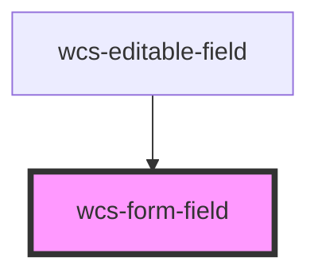

# Form field

<!-- Auto Generated Below -->

## Overview

TODO:
- [ ] Suffix button style

## Properties

| Property  | Attribute  | Description                                                                                                                                  | Type      | Default |
| --------- | ---------- | -------------------------------------------------------------------------------------------------------------------------------------------- | --------- | ------- |
| `isError` | `is-error` | Specifies whether the form field is in an error state. Displays the field border in red and the message contained in the wcs-error component | `boolean` | `false` |

## Dependencies

### Used by

 - [wcs-editable-field](../editable-field)

### Graph

----------------------------------------------

*Built with [StencilJS](https://stenciljs.com/)*
