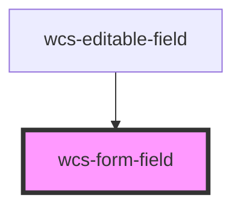

# Form field

<!-- Auto Generated Below -->

## Overview

Form field component wraps the native input element and add some more functionality on top of it.

You can use the `wcs-form-field` to wrap any of these components :
- `wcs-input`
- `wcs-textarea`
- `wcs-radio-group`
- `wcs-switch`
- `wcs-checkbox`
- `wcs-native-select`
- `wcs-select`
- `wcs-counter`

For non-supported slotted component, you can use the `required` attribute on the wrapped component to tell the
form-field that it is required. It will add a red star after the label of the form field.

## Accessibility guidelines 💡
- Each form control should be identified with a unique `wcs-label`
- Don't forget to add form validation to make sure the data is correctly formatted
- If the `wcs-label` is required, the form control must have the `required` HTML attribute and vice-versa (this is normally automatically set)
- The form should not be submittable if at least one required form control is not filled
- Hints are optional and should only be used to add extra information

## Properties

| Property  | Attribute  | Description                                                                                                                                  | Type      | Default |
| --------- | ---------- | -------------------------------------------------------------------------------------------------------------------------------------------- | --------- | ------- |
| `isError` | `is-error` | Specifies whether the form field is in an error state. Displays the field border in red and the message contained in the wcs-error component | `boolean` | `false` |

## Slots

| Slot          | Description                                                                              |
| ------------- | ---------------------------------------------------------------------------------------- |
| `"<no-name>"` | The main slot containing the wrapped component                                           |
| `"error"`     | Automatically filled when a `wcs-error` is provided                                      |
| `"label"`     | Automatically filled when a `wcs-label` is provided                                      |
| `"messages"`  | Automatically filled when a `wcs-hint` is provided                                       |
| `"prefix"`    | (Optional) Display a component as prefix. See "Prefix Suffix Group" story for more info. |
| `"suffix"`    | (Optional) Display a component as suffix. See "Prefix Suffix Group" story for more info. |

## Dependencies

### Used by

 - [wcs-editable-field](../editable-field)

### Graph

----------------------------------------------

*Built with [StencilJS](https://stenciljs.com/)*
