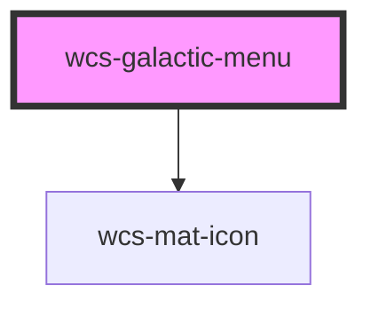

# wcs-galactic-menu

<!-- Auto Generated Below -->

## Properties

| Property | Attribute | Description                              | Type     | Default     |
| -------- | --------- | ---------------------------------------- | -------- | ----------- |
| `text`   | `text`    | Text to be displayed in the galactic bar | `string` | `undefined` |

## Methods

### `setAriaAttribute(attr: AriaAttributeName, value: string | null | undefined) => Promise<void>`

#### Parameters

| Name    | Type                         | Description |
| ------- | ---------------------------- | ----------- |
| `attr`  | `"role" \| `aria-${string}`` |             |
| `value` | `string`                     |             |

#### Returns

Type: `Promise<void>`

## Dependencies

### Depends on

- [wcs-mat-icon](../mat-icon)

### Graph

----------------------------------------------

*Built with [StencilJS](https://stenciljs.com/)*
