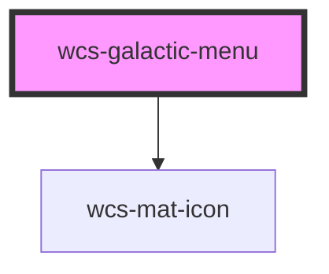

# wcs-galactic-menu

<!-- Auto Generated Below -->

## Overview

*Part of communication design system*
You can put a wcs-galactic-menu inside a wcs-galactic component to add an extra menu

## Properties

| Property | Attribute | Description                              | Type     | Default     |
| -------- | --------- | ---------------------------------------- | -------- | ----------- |
| `text`   | `text`    | Text to be displayed in the galactic bar | `string` | `undefined` |

## Methods

### `setAriaAttribute(attr: AriaAttributeName, value: string | null | undefined) => Promise<void>`

#### Parameters

| Name    | Type                         | Description |
| ------- | ---------------------------- | ----------- |
| `attr`  | ``aria-${string}` \| "role"` |             |
| `value` | `string`                     |             |

#### Returns

Type: `Promise<void>`

## Slots

| Slot          | Description         |
| ------------- | ------------------- |
| `"<no-name>"` | Main container slot |

## Dependencies

### Depends on

- [wcs-mat-icon](../mat-icon)

### Graph

```mermaid
graph TD;
  wcs-galactic-menu --> wcs-mat-icon
  style wcs-galactic-menu fill:#f9f,stroke:#333,stroke-width:4px
```

----------------------------------------------

*Built with [StencilJS](https://stenciljs.com/)*
