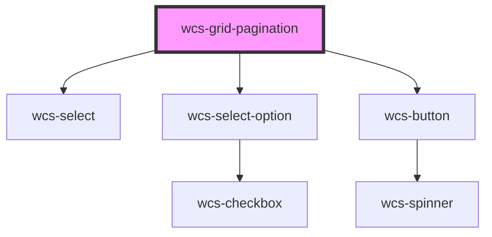

# wcs-grid-pagination

<!-- Auto Generated Below -->

## Overview

The grid pagination is a subcomponent of `wcs-grid`, slotted in `grid-pagination` under the `<table>` element.

## Properties

| Property             | Attribute      | Description                                                                                                                                                                                                                              | Type       | Default                           |
| -------------------- | -------------- | ---------------------------------------------------------------------------------------------------------------------------------------------------------------------------------------------------------------------------------------- | ---------- | --------------------------------- |
| `availablePageSizes` | --             | Set the available page sizes in the pagination dropdown on the left.                                                                                                                                                                     | `number[]` | `[10, 20, 50]`                    |
| `currentPage`        | `current-page` | The current page of the pagination. First page starts at index 0.                                                                                                                                                                        | `number`   | `GridPagination.INDEX_FIRST_PAGE` |
| `itemsCount`         | `items-count`  | Total elements in the grid.   - **Grid in `Server mode`** : You have to set `itemsCount` = your total data length.   - **Grid not in Server mode** : Do not set it manually : itemsCount is set and updated every pagination refresh.    | `number`   | `0`                               |
| `pageCount`          | `page-count`   | Max number of pages.   - **Grid in `Server mode`** : You have to set `pageCount` = `itemsCount` divided by `pageSize`.   - **Grid not in Server mode** : Do not set it manually : pageCount is set and updated every pagination refresh. | `number`   | `1`                               |
| `pageSize`           | `page-size`    | Maximum number of elements shown per page.   Default is the first value of `availablePageSizes`.                                                                                                                                         | `number`   | `this.availablePageSizes[0]`      |

## Events

| Event                     | Description                                | Type                                               |
| ------------------------- | ------------------------------------------ | -------------------------------------------------- |
| `wcsGridPaginationChange` | Event emitted when the pagination changes. | `CustomEvent<WcsGridPaginationChangeEventDetails>` |

## Dependencies

### Depends on

- [wcs-select](../select)
- [wcs-select-option](../select-option)
- [wcs-button](../button)

### Graph

----------------------------------------------

*Built with [StencilJS](https://stenciljs.com/)*
