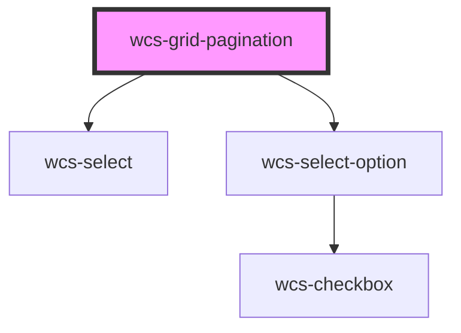

# wcs-grid-pagination

<!-- Auto Generated Below -->

## Properties

| Property             | Attribute      | Description | Type       | Default                      |
| -------------------- | -------------- | ----------- | ---------- | ---------------------------- |
| `availablePageSizes` | --             |             | `number[]` | `[10, 20, 50]`               |
| `currentPage`        | `current-page` |             | `number`   | `1`                          |
| `itemsCount`         | `items-count`  |             | `number`   | `0`                          |
| `pageCount`          | `page-count`   |             | `number`   | `0`                          |
| `pageSize`           | `page-size`    |             | `number`   | `this.availablePageSizes[0]` |

## Events

| Event                     | Description | Type                                               |
| ------------------------- | ----------- | -------------------------------------------------- |
| `wcsGridPaginationChange` |             | `CustomEvent<WcsGridPaginationChangeEventDetails>` |

## Dependencies

### Depends on

- [wcs-select](../select)
- [wcs-select-option](../select-option)

### Graph

----------------------------------------------

*Built with [StencilJS](https://stenciljs.com/)*
