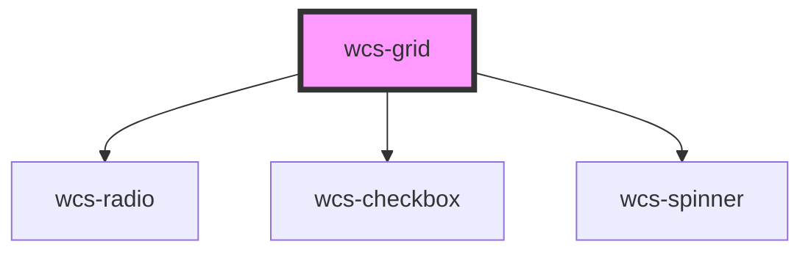

# Grid

## Available CSS Variables

|   Name                           | Description                 |
|:---------------------------------|:----------------------------|
| `--wcs-grid-highlight-color`     | Color for selected rows     |

## Basic

```html

<wcs-grid id="grid-1" selection="multiple" wcs-grid-pagination-id="grid-pagination">
    <wcs-grid-column id="grid-column-1" name="Prénom" path="first_name" sort></wcs-grid-column>
    <wcs-grid-column id="grid-column-2" name="Nom" path="last_name" sort></wcs-grid-column>
    <!-- <wcs-grid-pagination id="grid-pagination" page-size="2" items-count="2000" page-count="20" current-page="0"></wcs-grid-pagination> -->
</wcs-grid>

<wcs-grid-pagination id="grid-pagination" page-size="2" items-count="2000" page-count="20" current-page="0"></wcs-grid-pagination>


<wcs-grid id="grid-2" selection="multiple" >
    <wcs-grid-column id="grid-column-1" name="Prénom" path="person.first_name"></wcs-grid-column>
    <wcs-grid-column id="grid-column-2" name="Nom" path="person.last_name"></wcs-grid-column>
    <wcs-grid-column id="grid-column-2" name="Lien" path="link"></wcs-grid-column>
</wcs-grid>


```

<script>
    let wcsGridPagination = document.getElementById('grid-pagination');
    //wcsGridPagination.availablePageSizes = [2, 4, 6];
    /*wcsGridPagination.addEventListener('wcsGridPaginationChange', function (event) {
        console.log(event.detail);
        wcsGrid1.data = [{
            "id": 1,
            "first_name": "Mozes",
            "last_name": "Daleman",
            "email": "mdaleman0@dropbox.com",
            "ip_address": "14.151.191.92"
        }];
        wcsGridPagination.itemsCount = 100;
        wcsGridPagination.pageCount = 16;
        wcsGridPagination.currentPage = 8;
    });*/
    let wcsGridColumn1 = document.getElementById('grid-column-1');
    wcsGridColumn1.sortFn = (a, b) => {
        if(a.first_name < b.first_name) { return 1; }
        if(a.first_name > b.first_name) { return -1; }
        return 0;
    };
    wcsGridColumn1.formatter = (createElement, column, rowData) => {
        //return rowData.data.first_name;
        return createElement('wcs-button', {shape: 'small', mode: 'stroked', id: rowData.data.id, onClick: () => console.log('ici')}, rowData.data.first_name);
    };
    /* wcsGridColumn1.addEventListener('wcsSortChange', function (event) {
        console.log(event.detail);
        wcsGrid1.data = [{
            "id": 2,
            "first_name": "Humbert",
            "last_name": "Hegge",
            "email": "hhegge1@soup.io",
            "ip_address": "141.127.144.144"
        }];
        wcsGridPagination.itemsCount = 200;
        wcsGridPagination.pageCount = 9;
        wcsGridPagination.currentPage = 2;
    }); */

    let wcsGrid1 = document.getElementById('grid-1');
    wcsGrid1.addEventListener('wcsGridSelectionChange', function (event) { console.log(event.detail) });
    wcsGrid1.addEventListener('wcsGridAllSelectionChange', function (event) { console.log(event.detail) });
    wcsGrid1.loading = true;
    setTimeout(() => {
        wcsGrid1.data = [{
                "id": 1,
                "first_name": "Mozes",
                "last_name": "Daleman",
                "email": "mdaleman0@dropbox.com",
                "ip_address": "14.151.191.92"
            }, {
                "id": 2,
                "first_name": "Humbert",
                "last_name": "Hegge",
                "email": "hhegge1@soup.io",
                "ip_address": "141.127.144.144"
            }, {
                "id": 3,
                "first_name": "Tamara",
                "last_name": "Allday",
                "email": "tallday2@wufoo.com",
                "ip_address": "144.42.150.25"
            }, {
                "id": 4,
                "first_name": "Nicolai",
                "last_name": "Selley",
                "email": "nselley3@nbcnews.com",
                "ip_address": "179.227.142.220"
            }, {
                "id": 5,
                "first_name": "Efrem",
                "last_name": "Shearston",
                "email": "eshearston4@cpanel.net",
                "ip_address": "156.140.101.220"
            }, {
                "id": 6,
                "first_name": "Lonni",
                "last_name": "Swindin",
                "email": "lswindin5@wikipedia.org",
                "ip_address": "35.89.126.128"
            }
        ];
        wcsGrid1.loading = false;
    }, 3000);

    let wcsGrid2 = document.getElementById('grid-2');
    wcsGrid2.data = [{
      "person": {
        "first_name": "Yevette",
        "last_name": "Houlridge"
      },
      "link": "http://telegraph.co.uk"
    }, {
      "person": {
        "first_name": "Donella",
        "last_name": "Lievesley"
      },
      "link": "http://shutterfly.com"
    }, {
      "person": {
        "first_name": "Candida",
        "last_name": "Petrillo"
      },
      "link": "https://bbb.org"
    }, {
      "person": {
        "first_name": "Bail",
        "last_name": "Vevers"
      },
      "link": "https://nba.com"
    }];


</script>

<!-- Auto Generated Below -->


## Properties

| Property              | Attribute                | Description                                                              | Type                               | Default     |
| --------------------- | ------------------------ | ------------------------------------------------------------------------ | ---------------------------------- | ----------- |
| `data`                | --                       |                                                                          | `any[]`                            | `undefined` |
| `loading`             | `loading`                | Flag to display spinner during data loading                              | `boolean`                          | `undefined` |
| `selection`           | `selection`              | Used to manage grid's row selection                                      | `"multiple" \| "none" \| "single"` | `'none'`    |
| `serverMode`          | `server-mode`            | True to manage sort and pagination with a backend server, default: false | `boolean`                          | `undefined` |
| `wcsGridPaginationId` | `wcs-grid-pagination-id` |                                                                          | `string`                           | `undefined` |


## Events

| Event                       | Description                                            | Type                                             |
| --------------------------- | ------------------------------------------------------ | ------------------------------------------------ |
| `wcsGridAllSelectionChange` | Event emitted when all rows are selected or unselected | `CustomEvent<WcsGridAllRowSelectedEventDetails>` |
| `wcsGridSelectionChange`    | Event emitted when a row is selected or unselected     | `CustomEvent<WcsGridRowSelectedEventDetails>`    |


## Dependencies

### Depends on

- [wcs-radio](../radio)
- [wcs-checkbox](../checkbox)
- [wcs-spinner](../spinner)

### Graph


----------------------------------------------

*Built with [StencilJS](https://stenciljs.com/)*
