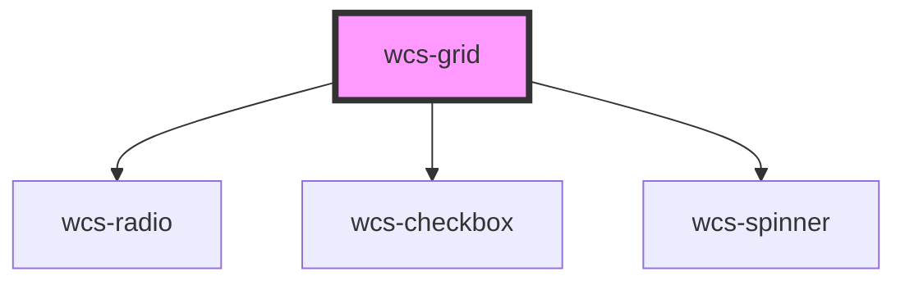

# Grid

<!-- Auto Generated Below -->

## Properties

| Property              | Attribute                | Description                                                                                                                          | Type                               | Default     |
| --------------------- | ------------------------ | ------------------------------------------------------------------------------------------------------------------------------------ | ---------------------------------- | ----------- |
| `data`                | --                       |                                                                                                                                      | `any[]`                            | `undefined` |
| `loading`             | `loading`                | Flag to display spinner during data loading                                                                                          | `boolean`                          | `undefined` |
| `rowIdPath`           | `row-id-path`            | Name of the object's key that will be used to display the cells whose keyValue attribute matches to the object's value for this key. | `string`                           | `undefined` |
| `selectedItems`       | `selected-items`         | Set the selected items                                                                                                               | `any`                              | `[]`        |
| `selectionConfig`     | `selection-config`       | Used to manage grid's row selection                                                                                                  | `"multiple" \| "none" \| "single"` | `'none'`    |
| `serverMode`          | `server-mode`            | True to manage sort and pagination with a backend server, default: false                                                             | `boolean`                          | `undefined` |
| `wcsGridPaginationId` | `wcs-grid-pagination-id` |                                                                                                                                      | `string`                           | `undefined` |

## Events

| Event                       | Description                                            | Type                                             |
| --------------------------- | ------------------------------------------------------ | ------------------------------------------------ |
| `wcsGridAllSelectionChange` | Event emitted when all rows are selected or unselected | `CustomEvent<WcsGridAllRowSelectedEventDetails>` |
| `wcsGridSelectionChange`    | Event emitted when a row is selected or unselected     | `CustomEvent<WcsGridRowSelectedEventDetails>`    |

## Dependencies

### Depends on

- [wcs-radio](../radio)
- [wcs-checkbox](../checkbox)
- [wcs-spinner](../spinner)

### Graph

----------------------------------------------

*Built with [StencilJS](https://stenciljs.com/)*
