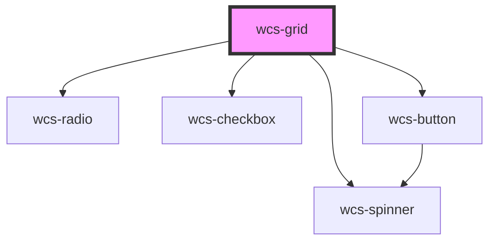

# Grid

<!-- Auto Generated Below -->

## Overview

The grid component is a complex component used as an HTML table to display collections of data.

## Properties

| Property              | Attribute                | Description                                                                                                                                                  | Type                               | Default       |
| --------------------- | ------------------------ | ------------------------------------------------------------------------------------------------------------------------------------------------------------ | ---------------------------------- | ------------- |
| `data`                | --                       | Contains the data to display in the table from a js object                                                                                                   | `any[]`                            | `undefined`   |
| `loading`             | `loading`                | Flag to display a spinner during data loading                                                                                                                | `boolean`                          | `undefined`   |
| `rowCssPartsFn`       | --                       | Function to add css parts to the grid rows, this allows you to customize the rows with css parts directly in you're application stylesheet.                  | `(row: WcsGridRow) => string[]`    | `(_) => null` |
| `rowIdPath`           | `row-id-path`            | Name of the object's key that will be used to display the cells whose `keyValue` attribute matches to the object's value for this key.                       | `string`                           | `undefined`   |
| `selectedItems`       | `selected-items`         | Set the selected items (rows)                                                                                                                                | `any`                              | `[]`          |
| `selectionConfig`     | `selection-config`       | Used to manage grid's row selection.   "none": no row can be selected.   "multiple": several rows can be selected.   "single": one row only can be selected. | `"multiple" \| "none" \| "single"` | `'none'`      |
| `serverMode`          | `server-mode`            | Manage sort and pagination with a backend server when set to `true`                                                                                          | `boolean`                          | `false`       |
| `wcsGridPaginationId` | `wcs-grid-pagination-id` | Automatically set by the component to reference the wcs-grid-pagination HTML element by its id.                                                              | `string`                           | `undefined`   |

## Events

| Event                       | Description                                            | Type                                             |
| --------------------------- | ------------------------------------------------------ | ------------------------------------------------ |
| `wcsBlur`                   | Event emitted when the grid loses focus.               | `CustomEvent<FocusEvent>`                        |
| `wcsFocus`                  | Event emitted when the grid has focus.                 | `CustomEvent<FocusEvent>`                        |
| `wcsGridAllSelectionChange` | Event emitted when all rows are selected or unselected | `CustomEvent<WcsGridAllRowSelectedEventDetails>` |
| `wcsGridSelectionChange`    | Event emitted when a row is selected or unselected     | `CustomEvent<WcsGridSelectionEventDetails>`      |

## Slots

| Slot                | Description                                                        |
| ------------------- | ------------------------------------------------------------------ |
| `"grid-column"`     | The slot containing the column of the grid in the `<thead>`        |
| `"grid-pagination"` | The slot containing the pagination of the grid below the `<table>` |

## Dependencies

### Depends on

- [wcs-radio](../radio)
- [wcs-checkbox](../checkbox)
- [wcs-spinner](../spinner)
- [wcs-button](../button)

### Graph

----------------------------------------------

*Built with [StencilJS](https://stenciljs.com/)*
