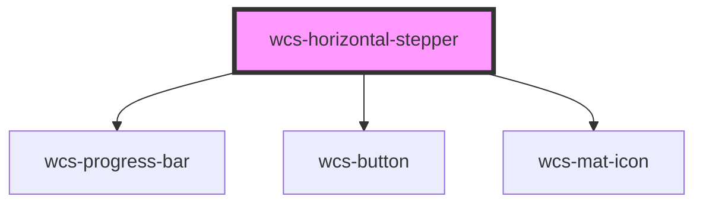

# Horizontal Stepper

## With icons

```html
<wcs-horizontal-stepper id="stepper-1"></wcs-horizontal-stepper>
<script>
    document.getElementById('stepper-1').steps = [
        {text: 'Initialisation', button: {kind: 'Icon', iconName: 'location_on'}},
        {text: 'Désactivé', disable: true, button: {kind: 'Icon', iconName: 'remove_circle_outline'}},
        {text: 'Informations personnelles', button: {kind: 'Icon', iconName: 'person'}},
        {text: 'Dossier', button: {kind: 'Icon', iconName: 'folder'}},
        {text: 'Finalisation', button: {kind: 'Icon', iconName: 'analytics', family: 'filled'}}
    ];
    
    document.getElementById('stepper-1').addEventListener('wcsHorizontalStepClick', event => {
        document.getElementById('stepper-1').currentStep = event.detail.index;
    })
</script>
```

## Example with text, without labels and in linear mode

```html
<wcs-horizontal-stepper id="stepper-2"></wcs-horizontal-stepper>
<script>
    document.getElementById('stepper-2').steps = [
        {button: {kind: 'Text', text: '1'}},
        {button: {kind: 'Text', text: '2'}},
        {button: {kind: 'Text', text: '3'}},
        {disable: true, button: {kind: 'Text', text: '4'}},
        {button: {kind: 'Text', text: '5'}}
    ];

    document.getElementById('stepper-2').mode = 'linear';
    
    document.getElementById('stepper-2').addEventListener('wcsHorizontalStepClick', event => {
        document.getElementById('stepper-2').currentStep = event.detail.index;
    })
</script>
```

<!-- Auto Generated Below -->


## Properties

| Property      | Attribute      | Description                                                                                                                          | Type                      | Default       |
| ------------- | -------------- | ------------------------------------------------------------------------------------------------------------------------------------ | ------------------------- | ------------- |
| `currentStep` | `current-step` | index of the active step. The index corresponds to the index of the step in the 'steps' list                                         | `number`                  | `0`           |
| `mode`        | `mode`         | Specifies if the stepper is in linear mode (the user can only click on the next step) or non-linear (the user can click on any step) | `"linear" \| "nonLinear"` | `'nonLinear'` |
| `steps`       | --             | steps to display                                                                                                                     | `HorizontalStepConfig[]`  | `undefined`   |


## Events

| Event                    | Description                             | Type                                    |
| ------------------------ | --------------------------------------- | --------------------------------------- |
| `wcsHorizontalStepClick` | Emits when the user selects a new step. | `CustomEvent<HorizontalStepClickEvent>` |


## Dependencies

### Depends on

- [wcs-progress-bar](../progress-bar)
- [wcs-button](../button)
- [wcs-mat-icon](../mat-icon)

### Graph


----------------------------------------------

*Built with [StencilJS](https://stenciljs.com/)*
