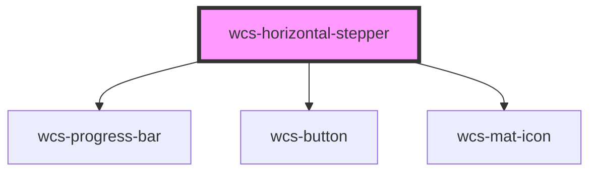

# Horizontal Stepper

## With icons

```html

<wcs-horizontal-stepper id="stepper-1"></wcs-horizontal-stepper>
<br/>
<wcs-button mode="clear" id="stepper-1-previous">Previous</wcs-button>
<wcs-button mode="clear" id="stepper-1-next">Next</wcs-button>
<script>
    const stepperElement = document.getElementById('stepper-1');
    stepperElement.steps = [
        {text: 'Initialisation', button: {kind: 'Icon', iconName: 'location_on'}},
        {text: 'Désactivé', disable: true, button: {kind: 'Icon', iconName: 'remove_circle_outline'}},
        {text: 'Informations personnelles', button: {kind: 'Icon', iconName: 'person'}},
        {text: 'Dossier', button: {kind: 'Icon', iconName: 'folder'}},
        {text: 'Finalisation', button: {kind: 'Icon', iconName: 'analytics', family: 'filled'}}
    ];


    stepperElement.addEventListener('wcsHorizontalStepClick', event => {
        stepperElement.currentStep = event.detail.index;
    });

    document.getElementById('stepper-1-previous').addEventListener('click', event => {
        stepperElement.previous();
    });
    document.getElementById('stepper-1-next').addEventListener('click', event => {
        stepperElement.next();
    });
</script>
```

## Example with text, without labels and in linear mode

```html

<wcs-horizontal-stepper id="stepper-2" check-on-complete></wcs-horizontal-stepper>
<br/>
<wcs-button mode="clear" id="stepper-2-previous">Previous</wcs-button>
<wcs-button mode="clear" id="stepper-2-next">Next</wcs-button>
<script>
    const stepper2Element = document.getElementById('stepper-2');
    stepper2Element.steps = [
        {button: {kind: 'Text', text: '1'}},
        {button: {kind: 'Text', text: '2'}},
        {button: {kind: 'Text', text: '3'}},
        {disable: true, button: {kind: 'Text', text: '4'}},
        {button: {kind: 'Text', text: '5'}},
        {complete: true, button: {kind: 'Text', text: '6'}},
        {button: {kind: 'Text', text: '7'}},
    ];

    stepper2Element.mode = 'linear';

    stepper2Element.addEventListener('wcsHorizontalStepClick', event => {
        stepper2Element.currentStep = event.detail.index;
    });

    document.getElementById('stepper-2-previous').addEventListener('click', event => {
        stepper2Element.previous();
    });
    document.getElementById('stepper-2-next').addEventListener('click', event => {
        stepper2Element.next();
    });
</script>
```

<!-- Auto Generated Below -->


## Properties

| Property          | Attribute           | Description                                                                                                                          | Type                      | Default       |
| ----------------- | ------------------- | ------------------------------------------------------------------------------------------------------------------------------------ | ------------------------- | ------------- |
| `checkOnComplete` | `check-on-complete` | Specifies whether a check should be displayed when a step is passed.                                                                 | `boolean`                 | `undefined`   |
| `currentStep`     | `current-step`      | index of the active step. The index corresponds to the index of the step in the 'steps' list                                         | `number`                  | `0`           |
| `mode`            | `mode`              | Specifies if the stepper is in linear mode (the user can only click on the next step) or non-linear (the user can click on any step) | `"linear" \| "nonLinear"` | `'nonLinear'` |
| `steps`           | --                  | steps to display                                                                                                                     | `HorizontalStepConfig[]`  | `undefined`   |


## Events

| Event                    | Description                             | Type                                    |
| ------------------------ | --------------------------------------- | --------------------------------------- |
| `wcsHorizontalStepClick` | Emits when the user selects a new step. | `CustomEvent<HorizontalStepClickEvent>` |


## Methods

### `next() => Promise<void>`


#### Returns

Type: `Promise<void>`


### `previous() => Promise<void>`


#### Returns

Type: `Promise<void>`


## Dependencies

### Depends on

- [wcs-progress-bar](../progress-bar)
- [wcs-button](../button)
- [wcs-mat-icon](../mat-icon)

### Graph


----------------------------------------------

*Built with [StencilJS](https://stenciljs.com/)*
