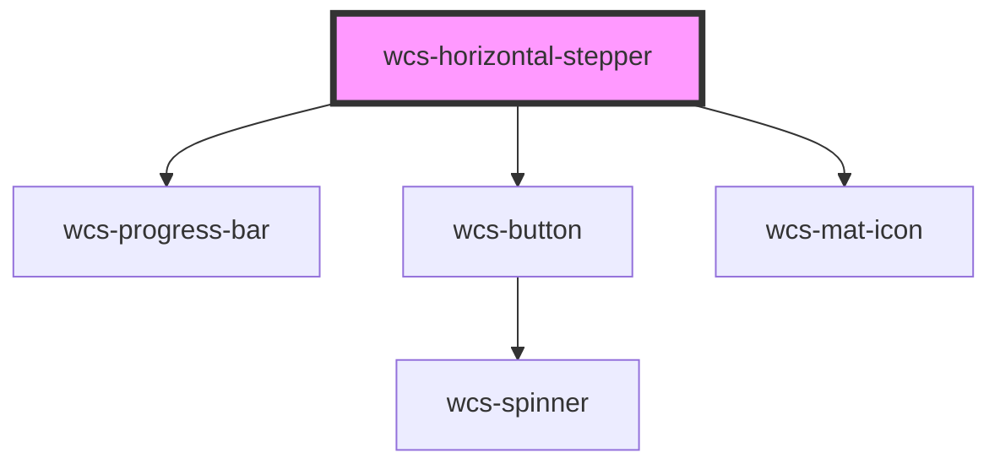

# Horizontal Stepper

<!-- Auto Generated Below -->

## Properties

| Property          | Attribute           | Description                                                                                                                          | Type                      | Default       |
| ----------------- | ------------------- | ------------------------------------------------------------------------------------------------------------------------------------ | ------------------------- | ------------- |
| `checkOnComplete` | `check-on-complete` | Specifies whether a check should be displayed when a step is passed.                                                                 | `boolean`                 | `undefined`   |
| `currentStep`     | `current-step`      | index of the active step. The index corresponds to the index of the step in the 'steps' list                                         | `number`                  | `0`           |
| `mode`            | `mode`              | Specifies if the stepper is in linear mode (the user can only click on the next step) or non-linear (the user can click on any step) | `"linear" \| "nonLinear"` | `'nonLinear'` |
| `steps`           | --                  | steps to display                                                                                                                     | `HorizontalStepConfig[]`  | `undefined`   |

## Events

| Event                    | Description                             | Type                                    |
| ------------------------ | --------------------------------------- | --------------------------------------- |
| `wcsHorizontalStepClick` | Emits when the user selects a new step. | `CustomEvent<HorizontalStepClickEvent>` |

## Methods

### `next() => Promise<void>`

#### Returns

Type: `Promise<void>`

### `previous() => Promise<void>`

#### Returns

Type: `Promise<void>`

## Dependencies

### Depends on

- [wcs-progress-bar](../progress-bar)
- [wcs-button](../button)
- [wcs-mat-icon](../mat-icon)

### Graph

----------------------------------------------

*Built with [StencilJS](https://stenciljs.com/)*
