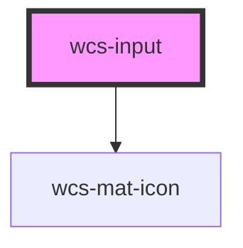

# Input

<!-- Auto Generated Below -->

## Overview

The input component is a form control that accepts a single line of text.
Implementation mainly inspired from Ionic Input Component.

    
Accessibility guidelines 💡

    > - Provide a `<wcs-label>` next to the input
    > - Use the `disabled` prop to add the HTML `disabled` attribute to the `input`
    > - Use the `readonly` prop to add the HTML `readonly` attribute to the `input`
    > - Use the `autofocus` prop to add the HTML `autofocus` attribute to the `input`. Use it if you want your input focus
    automatically when the page load
    > - Adapt the `type` to lets user enter information more easily (_ex: `type="number"` for an input which only accept numbers entry_)

## Properties

| Property         | Attribute        | Description                                                                                                                                                                                                                                                                                                                                                                                                                                                                                                                                                                                      | Type                                                                                                                                                                                                                                                                                                                                                                                                                                                                                                                                                                                                                                                                                                                                                                                                                                                                                                                        | Default        |
| ---------------- | ---------------- | ------------------------------------------------------------------------------------------------------------------------------------------------------------------------------------------------------------------------------------------------------------------------------------------------------------------------------------------------------------------------------------------------------------------------------------------------------------------------------------------------------------------------------------------------------------------------------------------------ | --------------------------------------------------------------------------------------------------------------------------------------------------------------------------------------------------------------------------------------------------------------------------------------------------------------------------------------------------------------------------------------------------------------------------------------------------------------------------------------------------------------------------------------------------------------------------------------------------------------------------------------------------------------------------------------------------------------------------------------------------------------------------------------------------------------------------------------------------------------------------------------------------------------------------- | -------------- |
| `accept`         | `accept`         | If the value of the type attribute is `"file"`, then this attribute will indicate the types of files that the server accepts, otherwise it will be ignored. The value must be a comma-separated list of unique content type specifiers.                                                                                                                                                                                                                                                                                                                                                          | `string`                                                                                                                                                                                                                                                                                                                                                                                                                                                                                                                                                                                                                                                                                                                                                                                                                                                                                                                    | `undefined`    |
| `autocapitalize` | `autocapitalize` | Indicates whether and how the text value should be automatically capitalized as it is entered/edited by the user. Available options: `"off"`, `"none"`, `"on"`, `"sentences"`, `"words"`, `"characters"`.                                                                                                                                                                                                                                                                                                                                                                                        | `string`                                                                                                                                                                                                                                                                                                                                                                                                                                                                                                                                                                                                                                                                                                                                                                                                                                                                                                                    | `'off'`        |
| `autocomplete`   | `autocomplete`   | Indicates whether the value of the control can be automatically completed by the browser.                                                                                                                                                                                                                                                                                                                                                                                                                                                                                                        | `"name" \| "on" \| "off" \| "honorific-prefix" \| "given-name" \| "additional-name" \| "family-name" \| "honorific-suffix" \| "nickname" \| "email" \| "username" \| "new-password" \| "current-password" \| "one-time-code" \| "organization-title" \| "organization" \| "street-address" \| "address-line1" \| "address-line2" \| "address-line3" \| "address-level4" \| "address-level3" \| "address-level2" \| "address-level1" \| "country" \| "country-name" \| "postal-code" \| "cc-name" \| "cc-given-name" \| "cc-additional-name" \| "cc-family-name" \| "cc-number" \| "cc-exp" \| "cc-exp-month" \| "cc-exp-year" \| "cc-csc" \| "cc-type" \| "transaction-currency" \| "transaction-amount" \| "language" \| "bday" \| "bday-day" \| "bday-month" \| "bday-year" \| "sex" \| "tel" \| "tel-country-code" \| "tel-national" \| "tel-area-code" \| "tel-local" \| "tel-extension" \| "impp" \| "url" \| "photo"` | `'off'`        |
| `autocorrect`    | `autocorrect`    | Whether auto correction should be enabled when the user is entering/editing the text value.                                                                                                                                                                                                                                                                                                                                                                                                                                                                                                      | `"off" \| "on"`                                                                                                                                                                                                                                                                                                                                                                                                                                                                                                                                                                                                                                                                                                                                                                                                                                                                                                             | `'off'`        |
| `autofocus`      | `autofocus`      | This Boolean attribute lets you specify that a form control should have input focus when the page loads.                                                                                                                                                                                                                                                                                                                                                                                                                                                                                         | `boolean`                                                                                                                                                                                                                                                                                                                                                                                                                                                                                                                                                                                                                                                                                                                                                                                                                                                                                                                   | `false`        |
| `clearInput`     | `clear-input`    | If `true`, a clear icon will appear in the input when there is a value. Clicking it clears the input.                                                                                                                                                                                                                                                                                                                                                                                                                                                                                            | `boolean`                                                                                                                                                                                                                                                                                                                                                                                                                                                                                                                                                                                                                                                                                                                                                                                                                                                                                                                   | `false`        |
| `clearOnEdit`    | `clear-on-edit`  | If `true`, the value will be cleared after focus upon edit. Defaults to `true` when `type` is `"password"`, `false` for all other types.                                                                                                                                                                                                                                                                                                                                                                                                                                                         | `boolean`                                                                                                                                                                                                                                                                                                                                                                                                                                                                                                                                                                                                                                                                                                                                                                                                                                                                                                                   | `undefined`    |
| `debounce`       | `debounce`       | Set the amount of time, in milliseconds, to wait to trigger the `wcsChange` event after each keystroke. This also impacts form bindings such as `ngModel` or `v-model`.                                                                                                                                                                                                                                                                                                                                                                                                                          | `number`                                                                                                                                                                                                                                                                                                                                                                                                                                                                                                                                                                                                                                                                                                                                                                                                                                                                                                                    | `0`            |
| `disabled`       | `disabled`       | If `true`, the user cannot interact with the input.                                                                                                                                                                                                                                                                                                                                                                                                                                                                                                                                              | `boolean`                                                                                                                                                                                                                                                                                                                                                                                                                                                                                                                                                                                                                                                                                                                                                                                                                                                                                                                   | `false`        |
| `enterkeyhint`   | `enterkeyhint`   | A hint to the browser for which enter key to display. Possible values: `"enter"`, `"done"`, `"go"`, `"next"`, `"previous"`, `"search"`, and `"send"`.                                                                                                                                                                                                                                                                                                                                                                                                                                            | `"done" \| "enter" \| "go" \| "next" \| "previous" \| "search" \| "send"`                                                                                                                                                                                                                                                                                                                                                                                                                                                                                                                                                                                                                                                                                                                                                                                                                                                   | `undefined`    |
| `icon`           | `icon`           | Name of the material icon to add to the input                                                                                                                                                                                                                                                                                                                                                                                                                                                                                                                                                    | `string`                                                                                                                                                                                                                                                                                                                                                                                                                                                                                                                                                                                                                                                                                                                                                                                                                                                                                                                    | `undefined`    |
| `inputmode`      | `inputmode`      | A hint to the browser for which keyboard to display. Possible values: `"none"`, `"text"`, `"tel"`, `"url"`, `"email"`, `"numeric"`, `"decimal"`, and `"search"`.                                                                                                                                                                                                                                                                                                                                                                                                                                 | `"decimal" \| "email" \| "none" \| "numeric" \| "search" \| "tel" \| "text" \| "url"`                                                                                                                                                                                                                                                                                                                                                                                                                                                                                                                                                                                                                                                                                                                                                                                                                                       | `undefined`    |
| `max`            | `max`            | The maximum value, which must not be less than its minimum (min attribute) value.                                                                                                                                                                                                                                                                                                                                                                                                                                                                                                                | `string`                                                                                                                                                                                                                                                                                                                                                                                                                                                                                                                                                                                                                                                                                                                                                                                                                                                                                                                    | `undefined`    |
| `maxlength`      | `maxlength`      | If the value of the type attribute is `text`, `email`, `search`, `password`, `tel`, or `url`, this attribute specifies the maximum number of characters that the user can enter.                                                                                                                                                                                                                                                                                                                                                                                                                 | `number`                                                                                                                                                                                                                                                                                                                                                                                                                                                                                                                                                                                                                                                                                                                                                                                                                                                                                                                    | `undefined`    |
| `min`            | `min`            | The minimum value, which must not be greater than its maximum (max attribute) value.                                                                                                                                                                                                                                                                                                                                                                                                                                                                                                             | `string`                                                                                                                                                                                                                                                                                                                                                                                                                                                                                                                                                                                                                                                                                                                                                                                                                                                                                                                    | `undefined`    |
| `minlength`      | `minlength`      | If the value of the type attribute is `text`, `email`, `search`, `password`, `tel`, or `url`, this attribute specifies the minimum number of characters that the user can enter.                                                                                                                                                                                                                                                                                                                                                                                                                 | `number`                                                                                                                                                                                                                                                                                                                                                                                                                                                                                                                                                                                                                                                                                                                                                                                                                                                                                                                    | `undefined`    |
| `multiple`       | `multiple`       | If `true`, the user can enter more than one value. This attribute applies when the type attribute is set to `"email"` or `"file"`, otherwise it is ignored.                                                                                                                                                                                                                                                                                                                                                                                                                                      | `boolean`                                                                                                                                                                                                                                                                                                                                                                                                                                                                                                                                                                                                                                                                                                                                                                                                                                                                                                                   | `undefined`    |
| `name`           | `name`           | The name of the control, which is submitted with the form data.                                                                                                                                                                                                                                                                                                                                                                                                                                                                                                                                  | `string`                                                                                                                                                                                                                                                                                                                                                                                                                                                                                                                                                                                                                                                                                                                                                                                                                                                                                                                    | `this.inputId` |
| `pattern`        | `pattern`        | A regular expression that the value is checked against. The pattern must match the entire value, not just some subset. Use the title attribute to describe the pattern to help the user. This attribute applies when the value of the type attribute is `"text"`, `"search"`, `"tel"`, `"url"`, `"email"`, `"date"`, or `"password"`, otherwise it is ignored. When the type attribute is `"date"`, `pattern` will only be used in browsers that do not support the `"date"` input type natively. See https://developer.mozilla.org/en-US/docs/Web/HTML/Element/input/date for more information. | `string`                                                                                                                                                                                                                                                                                                                                                                                                                                                                                                                                                                                                                                                                                                                                                                                                                                                                                                                    | `undefined`    |
| `placeholder`    | `placeholder`    | Instructional text that shows before the input has a value.                                                                                                                                                                                                                                                                                                                                                                                                                                                                                                                                      | `string`                                                                                                                                                                                                                                                                                                                                                                                                                                                                                                                                                                                                                                                                                                                                                                                                                                                                                                                    | `undefined`    |
| `prefixLabel`    | `prefix-label`   | Prefix displayed before the text field contents. This is not included in the value.                                                                                                                                                                                                                                                                                                                                                                                                                                                                                                              | `string`                                                                                                                                                                                                                                                                                                                                                                                                                                                                                                                                                                                                                                                                                                                                                                                                                                                                                                                    | `undefined`    |
| `readonly`       | `readonly`       | If `true`, the user cannot modify the value.                                                                                                                                                                                                                                                                                                                                                                                                                                                                                                                                                     | `boolean`                                                                                                                                                                                                                                                                                                                                                                                                                                                                                                                                                                                                                                                                                                                                                                                                                                                                                                                   | `false`        |
| `required`       | `required`       | If `true`, the user must fill in a value before submitting a form.                                                                                                                                                                                                                                                                                                                                                                                                                                                                                                                               | `boolean`                                                                                                                                                                                                                                                                                                                                                                                                                                                                                                                                                                                                                                                                                                                                                                                                                                                                                                                   | `false`        |
| `size`           | `size`           | Specify the size (height) of the input.                                                                                                                                                                                                                                                                                                                                                                                                                                                                                                                                                          | `"l" \| "m" \| "s"`                                                                                                                                                                                                                                                                                                                                                                                                                                                                                                                                                                                                                                                                                                                                                                                                                                                                                                         | `'m'`          |
| `spellcheck`     | `spellcheck`     | If `true`, the element will have its spelling and grammar checked.                                                                                                                                                                                                                                                                                                                                                                                                                                                                                                                               | `boolean`                                                                                                                                                                                                                                                                                                                                                                                                                                                                                                                                                                                                                                                                                                                                                                                                                                                                                                                   | `false`        |
| `state`          | `state`          | Specifies the state of the input. By default the input is in an normal state but you can to set it to 'error' state if the data given by the user is not valid.                                                                                                                                                                                                                                                                                                                                                                                                                                  | `"error" \| "initial"`                                                                                                                                                                                                                                                                                                                                                                                                                                                                                                                                                                                                                                                                                                                                                                                                                                                                                                      | `'initial'`    |
| `step`           | `step`           | Works with the min and max attributes to limit the increments at which a value can be set. Possible values are: `"any"` or a positive floating point number.                                                                                                                                                                                                                                                                                                                                                                                                                                     | `string`                                                                                                                                                                                                                                                                                                                                                                                                                                                                                                                                                                                                                                                                                                                                                                                                                                                                                                                    | `undefined`    |
| `suffixLabel`    | `suffix-label`   | Suffix displayed after the text field contents. This is not included in the value.                                                                                                                                                                                                                                                                                                                                                                                                                                                                                                               | `string`                                                                                                                                                                                                                                                                                                                                                                                                                                                                                                                                                                                                                                                                                                                                                                                                                                                                                                                    | `undefined`    |
| `type`           | `type`           | The type of control to display. The default type is text.                                                                                                                                                                                                                                                                                                                                                                                                                                                                                                                                        | `"date" \| "datetime-local" \| "email" \| "file" \| "month" \| "number" \| "password" \| "search" \| "tel" \| "text" \| "time" \| "url" \| "week"`                                                                                                                                                                                                                                                                                                                                                                                                                                                                                                                                                                                                                                                                                                                                                                          | `'text'`       |
| `value`          | `value`          | The value of the input.                                                                                                                                                                                                                                                                                                                                                                                                                                                                                                                                                                          | `number \| string`                                                                                                                                                                                                                                                                                                                                                                                                                                                                                                                                                                                                                                                                                                                                                                                                                                                                                                          | `''`           |

## Events

| Event       | Description                             | Type                                  |
| ----------- | --------------------------------------- | ------------------------------------- |
| `wcsBlur`   | Emitted when the input loses focus.     | `CustomEvent<FocusEvent>`             |
| `wcsChange` | Emitted when the value has changed.     | `CustomEvent<InputChangeEventDetail>` |
| `wcsFocus`  | Emitted when the input has focus.       | `CustomEvent<FocusEvent>`             |
| `wcsInput`  | Emitted when a keyboard input occurred. | `CustomEvent<KeyboardEvent>`          |

## Methods

### `getInputElement() => Promise<HTMLInputElement>`

Returns the native `<input>` element used under the hood.

#### Returns

Type: `Promise<HTMLInputElement>`

### `setFocus() => Promise<void>`

**[DEPRECATED]** use the native focus method instead
Sets focus on the native `input` in `wcs-input`.  

#### Returns

Type: `Promise<void>`

## Shadow Parts

| Part       | Description |
| ---------- | ----------- |
| `"prefix"` |             |
| `"suffix"` |             |

## Dependencies

### Depends on

- [wcs-mat-icon](../mat-icon)

### Graph

----------------------------------------------

*Built with [StencilJS](https://stenciljs.com/)*
