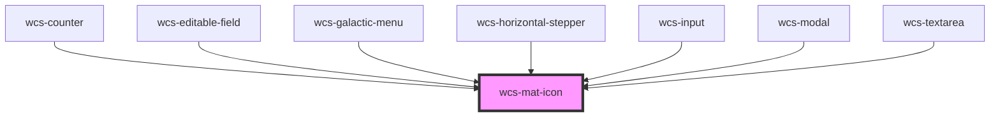

# Material Icon

<!-- Auto Generated Below -->

## Properties

| Property | Attribute | Description                           | Type                                                          | Default     |
| -------- | --------- | ------------------------------------- | ------------------------------------------------------------- | ----------- |
| `family` | `family`  | Family of the icon                    | `"filled" \| "outlined" \| "rounded" \| "sharp" \| "twotone"` | `'filled'`  |
| `icon`   | `icon`    | Use the icon name from Material Icons | `string`                                                      | `undefined` |
| `size`   | `size`    | Size of the icon                      | `"l" \| "m" \| "s" \| "xl"`                                   | `'m'`       |

## Dependencies

### Used by

 - [wcs-counter](../counter)
 - [wcs-editable-field](../editable-field)
 - [wcs-galactic-menu](../galactic-menu)
 - [wcs-horizontal-stepper](../horizontal-stepper)
 - [wcs-input](../input)
 - [wcs-modal](../modal)
 - [wcs-textarea](../textarea)

### Graph

----------------------------------------------

*Built with [StencilJS](https://stenciljs.com/)*
