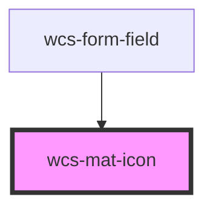

# Material Icon

A component used to display Material Icon, can be usefull when used in wcs-grid.

When used directly in an other Web Component, the global CSS stylesheet doesn't apply to material-icons.
In this case you can use the Mat-icon with its integrated material stylesheet.

<!-- Auto Generated Below -->

## Properties

| Property | Attribute | Description                           | Type                        | Default     |
| -------- | --------- | ------------------------------------- | --------------------------- | ----------- |
| `icon`   | `icon`    | Use the icon name from Material Icons | `string`                    | `undefined` |
| `size`   | `size`    | Size of the icon                      | `"l" \| "m" \| "s" \| "xl"` | `'m'`       |

## Dependencies

### Used by

 - [wcs-form-field](../form-field)

### Graph

----------------------------------------------

*Built with [StencilJS](https://stenciljs.com/)*
