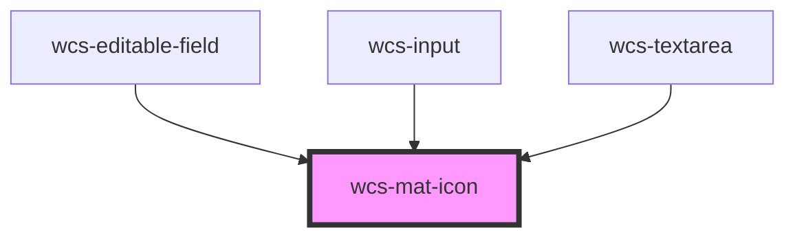

# Material Icon

A component used to display Material Icon, can be usefull when used in wcs-grid.

When used directly in an other Web Component, the global CSS stylesheet doesn't apply to material-icons.
In this case you can use the Mat-icon with its integrated material stylesheet.

```html
<wcs-mat-icon size="s" icon="info"></wcs-mat-icon>
```

```html
<wcs-mat-icon size="m" icon="info" family="outlined"></wcs-mat-icon>
```

```html
<wcs-mat-icon size="l" icon="info" family="twotone"></wcs-mat-icon>
```

```html
<wcs-mat-icon size="xl" icon="info" family="rounded"></wcs-mat-icon>
```

```html
<wcs-mat-icon size="s" icon="info" family="sharp"></wcs-mat-icon>
```

<!-- Auto Generated Below -->


## Properties

| Property | Attribute | Description                           | Type                                                          | Default     |
| -------- | --------- | ------------------------------------- | ------------------------------------------------------------- | ----------- |
| `family` | `family`  | Family of the icon                    | `"filled" \| "outlined" \| "rounded" \| "sharp" \| "twotone"` | `'filled'`  |
| `icon`   | `icon`    | Use the icon name from Material Icons | `string`                                                      | `undefined` |
| `size`   | `size`    | Size of the icon                      | `"l" \| "m" \| "s" \| "xl"`                                   | `'m'`       |


## Dependencies

### Used by

 - [wcs-editable-field](../editable-field)
 - [wcs-input](../input)
 - [wcs-textarea](../textarea)

### Graph


----------------------------------------------

*Built with [StencilJS](https://stenciljs.com/)*
