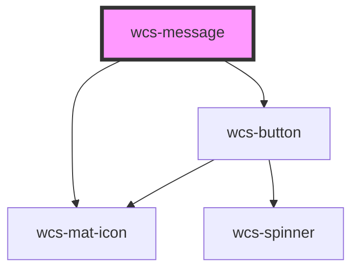

# wcs-message

<!-- Auto Generated Below -->

## Overview

Messages are used to communicate contextual information to users.
They can display information, success, warning, or error states.

Unlike alerts, messages are static feedback elements and are not automatically dismissed.

## Properties

| Property          | Attribute           | Description                                                                                                                                                                        | Type                                                 | Default         |
| ----------------- | ------------------- | ---------------------------------------------------------------------------------------------------------------------------------------------------------------------------------- | ---------------------------------------------------- | --------------- |
| `background`      | `background`        | Defines the background appearance of the message.                                                                                                                                  | `"lighter" \| "lightest"`                            | `'lightest'`    |
| `intent`          | `intent`            | Defines the semantic intent of the message. - Non-disruptive messages (`information`, `success`) use `role="status"` - Disruptive messages (`warning`, `error`) use `role="alert"` | `"error" \| "information" \| "success" \| "warning"` | `'information'` |
| `showBorder`      | `show-border`       | Defines whether the message should have a border. The border color is determined by the intent of the message.                                                                     | `boolean`                                            | `false`         |
| `showCloseButton` | `show-close-button` | Specifies whether the component should display a close button.                                                                                                                     | `boolean`                                            | `false`         |

## Events

| Event               | Description                                  | Type                |
| ------------------- | -------------------------------------------- | ------------------- |
| `wcsMessageDismiss` | Event emitted when the message is dismissed. | `CustomEvent<void>` |

## Slots

| Slot         | Description                     |
| ------------ | ------------------------------- |
| `"subtitle"` | Subtitle content of the message |
| `"title"`    | Title content of the message    |

## Dependencies

### Depends on

- [wcs-mat-icon](../mat-icon)
- [wcs-button](../button)

### Graph

----------------------------------------------

*Built with [StencilJS](https://stenciljs.com/)*
