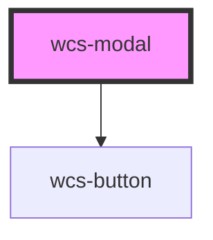

# Modal

```html

<wcs-button onclick="getElementById('modal-1').setAttribute('show', true)" id="btn-modal-1-show">Afficher la boîte de dialogue</wcs-button>

<wcs-modal show="false" id="modal-1">
    <div slot="wcs-modal-header">Modal title</div>
    Voulez-vous quittez la page ? 
    <br/>
    Lorem ipsum dolor sit amet, consectetur adipiscing elit. Duis a cursus mi. Nullam et sem mi. Interdum et malesuada fames ac ante ipsum primis in faucibus. Fusce sollicitudin pellentesque libero nec elementum.
    <div slot="wcs-modal-actions">
        <wcs-button class="wcs-dark" mode="stroked">C'est non</wcs-button>
        <wcs-button>J'accepte</wcs-button>
    </div>
</wcs-modal>
```


<!-- Auto Generated Below -->


## Properties

| Property          | Attribute           | Description                                                                  | Type      | Default |
| ----------------- | ------------------- | ---------------------------------------------------------------------------- | --------- | ------- |
| `backdrop`        | `backdrop`          | Specifies whether the component should display a backdrop on the entire page | `boolean` | `true`  |
| `show`            | `show`              | Displays the modal                                                           | `boolean` | `true`  |
| `showCloseButton` | `show-close-button` |                                                                              | `boolean` | `true`  |


## Events

| Event               | Description                                                        | Type                |
| ------------------- | ------------------------------------------------------------------ | ------------------- |
| `wcs-dialog-closed` | Triggered when the user leaves the dialog with the closing button. | `CustomEvent<void>` |


## Dependencies

### Depends on

- [wcs-button](../button)

### Graph


----------------------------------------------

*Built with [StencilJS](https://stenciljs.com/)*
