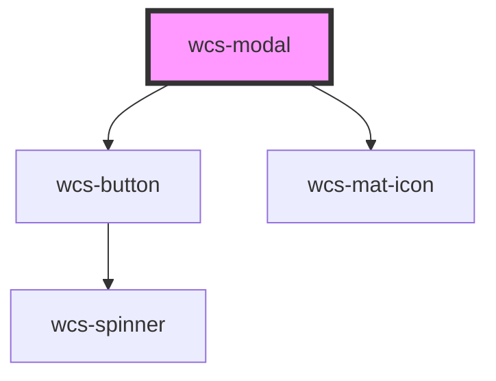

# Modal

## Modal without backdrop

```html
<wcs-modal id="modal-2" backdrop="false" show-close-button="true">
    <div slot="header">Modal title</div>
    Voulez-vous quittez la page ? 
    <br/>
    Lorem ipsum dolor sit amet, consectetur adipiscing elit. Duis a cursus mi. Nullam et sem mi. Interdum et malesuada fames ac ante ipsum primis in faucibus. Fusce sollicitudin pellentesque libero nec elementum.
    <div slot="actions">
        <wcs-button class="wcs-dark" mode="stroked">C'est non</wcs-button>
        <wcs-button>J'accepte</wcs-button>
    </div>
</wcs-modal>
```

<wcs-button onclick="getElementById('modal-2').setAttribute('show', true)" id="btn-modal-2-show">
    Afficher la boîte de dialogue
</wcs-button>

<!-- Auto Generated Below -->


## Overview

The modal component (also named dialog or popup) is an interface element that appears on top of the page content.
Use it to show a message, a confirmation dialog, or any other content like forms.

## Accessibility guidelines 💡
> - Modal element has `role="dialog"` and `aria-modal="true"`
> - Keyboard navigation is trapped inside the modal
> - It is mandatory to set the `modal-trigger-controls-id` to the id of the element that opens the dialog, in order
> to focus it upon dialog dismissal.
> - The modal can be closed at any time by pressing the Escape key.
>
> - More info : https://www.w3.org/WAI/ARIA/apg/patterns/dialog-modal/

## Properties

| Property                 | Attribute                   | Description                                                                                                                                                                                                                | Type                        | Default     |
| ------------------------ | --------------------------- | -------------------------------------------------------------------------------------------------------------------------------------------------------------------------------------------------------------------------- | --------------------------- | ----------- |
| `closeButtonAriaLabel`   | `close-button-aria-label`   | Specifies the aria-label present on the close button when the modal is opened.   Only use when `showCloseButton` is `true`.                                                                                                | `string`                    | `'Fermer'`  |
| `hideActions`            | `hide-actions`              | Specifies whether the component should hide the actions slot or not                                                                                                                                                        | `boolean`                   | `false`     |
| `modalTriggerControlsId` | `modal-trigger-controls-id` | Specifies which element id controls the modal                                                                                                                                                                              | `string`                    | `undefined` |
| `show`                   | `show`                      | Displays the modal                                                                                                                                                                                                         | `boolean`                   | `false`     |
| `showCloseButton`        | `show-close-button`         | Specifies whether the component should display a close button. if false, it won't close the modal when the escape key is pressed.                                                                                          | `boolean`                   | `false`     |
| `size`                   | `size`                      | There are multiple sizes for modals. The default size is medium (m), however other sizes are available. Select the size best suited for the content and screen size displaying the modal. Remember to test responsiveness. | `"l" \| "m" \| "s" \| "xl"` | `'m'`       |
| `withoutBackdrop`        | `without-backdrop`          | Specifies whether the component should display a backdrop on the entire page                                                                                                                                               | `boolean`                   | `false`     |


## Events

| Event             | Description                                                        | Type                |
| ----------------- | ------------------------------------------------------------------ | ------------------- |
| `wcsDialogClosed` | Triggered when the user leaves the dialog with the closing button. | `CustomEvent<void>` |


## Methods

### `setAriaAttribute(attr: AriaAttributeName, value: string | null | undefined) => Promise<void>`


#### Parameters

| Name    | Type                         | Description |
| ------- | ---------------------------- | ----------- |
| `attr`  | `"role" \| `aria-${string}`` |             |
| `value` | `string`                     |             |

#### Returns

Type: `Promise<void>`


## Slots

| Slot                                             | Description |
| ------------------------------------------------ | ----------- |
| `"<no-name> Main container slot"`                |             |
| `"actions Actions container slot (for buttons)"` |             |
| `"header Header container slot (for title)"`     |             |


## Dependencies

### Depends on

- [wcs-button](../button)
- [wcs-mat-icon](../mat-icon)

### Graph


----------------------------------------------

*Built with [StencilJS](https://stenciljs.com/)*
