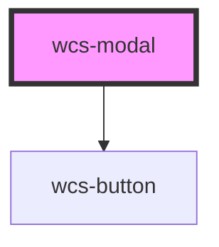

# Modal

## Modal without backdrop

```html
<wcs-modal id="modal-2" backdrop="false" show-close-button="true">
    <div slot="header">Modal title</div>
    Voulez-vous quittez la page ? 
    <br/>
    Lorem ipsum dolor sit amet, consectetur adipiscing elit. Duis a cursus mi. Nullam et sem mi. Interdum et malesuada fames ac ante ipsum primis in faucibus. Fusce sollicitudin pellentesque libero nec elementum.
    <div slot="actions">
        <wcs-button class="wcs-dark" mode="stroked">C'est non</wcs-button>
        <wcs-button>J'accepte</wcs-button>
    </div>
</wcs-modal>
```

<wcs-button onclick="getElementById('modal-2').setAttribute('show', true)" id="btn-modal-2-show">
    Afficher la boîte de dialogue
</wcs-button>

<!-- Auto Generated Below -->


## Properties

| Property          | Attribute           | Description                                                                                                                       | Type      | Default |
| ----------------- | ------------------- | --------------------------------------------------------------------------------------------------------------------------------- | --------- | ------- |
| `backdrop`        | `backdrop`          | Specifies whether the component should display a backdrop on the entire page                                                      | `boolean` | `true`  |
| `show`            | `show`              | Displays the modal                                                                                                                | `boolean` | `false` |
| `showCloseButton` | `show-close-button` | Specifies whether the component should display a close button. if false, it won't close the modal when the escape key is pressed. | `boolean` | `false` |


## Events

| Event             | Description                                                        | Type                |
| ----------------- | ------------------------------------------------------------------ | ------------------- |
| `wcsDialogClosed` | Triggered when the user leaves the dialog with the closing button. | `CustomEvent<void>` |


## Dependencies

### Depends on

- [wcs-button](../button)

### Graph


----------------------------------------------

*Built with [StencilJS](https://stenciljs.com/)*
