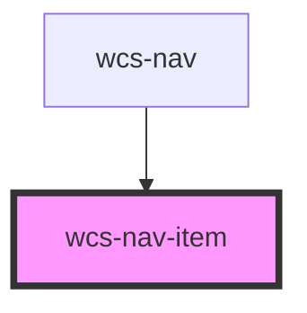

# Nav Item

<!-- Auto Generated Below -->

## Properties

| Property | Attribute | Description                                  | Type     | Default |
| -------- | --------- | -------------------------------------------- | -------- | ------- |
| `text`   | `text`    | This attribute specify the text of the item. | `string` | `''`    |

## Dependencies

### Used by

 - [wcs-nav](../nav)

### Graph

----------------------------------------------

*Built with [StencilJS](https://stenciljs.com/)*
