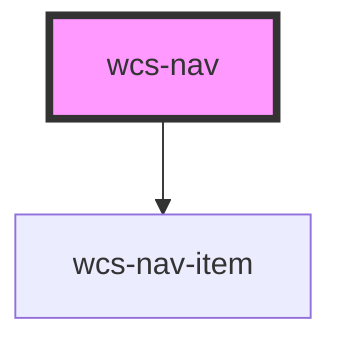

# Nav

<wcs-nav>
    <wcs-nav-item text="Favoris"><i class="material-icons icons icons-size-1x5">star</i></wcs-nav-item>
    <wcs-nav-item text="Collections"><i class="material-icons icons icons-size-1x5">folder</i></wcs-nav-item>
    <wcs-nav-item text="Ma base documentaire"><i class="material-icons icons icons-size-1x5">description</i></wcs-nav-item>
    <wcs-nav-item text="Distribution"><i class="material-icons icons icons-size-1x5">forward</i></wcs-nav-item>
    <wcs-nav-item text="Admin" class="d-none d-lg-flex"><i class="material-icons icons icons-size-1x5">brightness_7</i></wcs-nav-item>
    <wcs-nav-item text="Plus" class="d-lg-none"><i class="material-icons icons icons-size-1x5">more_horiz</i></wcs-nav-item>
</wcs-nav>

<!-- Auto Generated Below -->

## Dependencies

### Depends on

- [wcs-nav-item](../nav-item)

### Graph

----------------------------------------------

*Built with [StencilJS](https://stenciljs.com/)*
