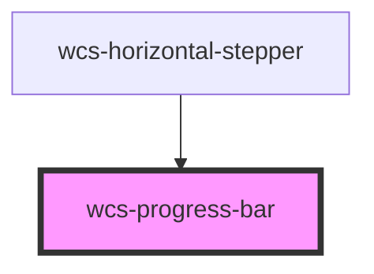

# Progress bar

<!-- Auto Generated Below -->

## Overview

The progress-bar component is a horizontal bar that indicates the current completion of a task.

## Accessibility guidelines 💡
> Aria attributes and how to display the progress-bar depend on the use case in your application :
>  
> - **Case 1 : decorative**  
> If the progress-bar is used as a decoration _(if removed, the user doesn't lose any relevant information)_ or in the
> context of another component _(such as progress-bar in a card, stepper, ...)_ => **you don't need to show the label nor add an aria-label**.
> 
> - **Case 2 : informative**  
> If the progress-bar is used to convey important information _(e.g., form completion status, dashboard KPI)_, you need to :
>   - **Provide a visible label** that describes the purpose of the progress-bar.
>   - **Set the `showLabel` property to `true`** to show the percentage above the progress-bar.
>   - Optionally, use aria-label to provide an accessible name if a visible label is not present.

## Properties

| Property    | Attribute    | Description                                                                      | Type         | Default |
| ----------- | ------------ | -------------------------------------------------------------------------------- | ------------ | ------- |
| `showLabel` | `show-label` | Whether it displays a label indicating the percentage of progress above the bar. | `boolean`    | `false` |
| `size`      | `size`       | Specify the size of the progress bar.   m = default, s = smaller                 | `"m" \| "s"` | `'m'`   |
| `value`     | `value`      | The actual value of the progress. Ranging from 0 to 100.                         | `number`     | `0`     |

## Dependencies

### Used by

 - [wcs-horizontal-stepper](../horizontal-stepper)

### Graph

----------------------------------------------

*Built with [StencilJS](https://stenciljs.com/)*
