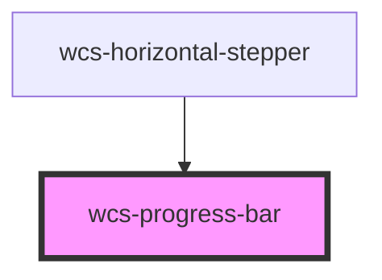

# Progress bar

<!-- Auto Generated Below -->

## Overview

Component displaying progress as a horizontal bar.

## Properties

| Property    | Attribute    | Description                                                                      | Type         | Default |
| ----------- | ------------ | -------------------------------------------------------------------------------- | ------------ | ------- |
| `showLabel` | `show-label` | Whether it displays a label indicating the percentage of progress above the bar. | `boolean`    | `false` |
| `size`      | `size`       | Specify the size of the progress bar.   m = default, s = smaller                 | `"m" \| "s"` | `'m'`   |
| `value`     | `value`      | The actual value of the progress. Ranging from 0 to 100.                         | `number`     | `0`     |

## Dependencies

### Used by

 - [wcs-horizontal-stepper](../horizontal-stepper)

### Graph

----------------------------------------------

*Built with [StencilJS](https://stenciljs.com/)*
