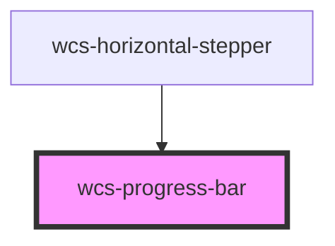

# Progress bar

## Available CSS Variables

|   Name                                   | Description                         |
|:-----------------------------------------|:------------------------------------|
| `--wcs-progress-bar-border-radius`       | Border radius                       |
| `--wcs-progress-bar-border-radius-small` | Border radius for small mode        |
| `--wcs-progress-bar-animation-duration`  | Animation duration                  |

## Basic

```html

<wcs-progress-bar value="50"></wcs-progress-bar>
```

## Bar with label

```html

<wcs-progress-bar value="50" show-label="true"></wcs-progress-bar>
```

## Small bar

```html

<wcs-progress-bar value="20" small></wcs-progress-bar>
```

<wcs-button mode="stroked" class="wcs-primary" style="position: absolute; right: 16px; bottom: 16px;"
id="progress-bar-button">
Change values
</wcs-button>

<script>
    document.querySelector('#progress-bar-button').addEventListener('click', () => {
        document.querySelectorAll('wcs-progress-bar')
            .forEach(p => p.setAttribute('value', Math.ceil(Math.random() * 100)));
    });
</script>


<!-- Auto Generated Below -->

## Properties

| Property    | Attribute    | Description                                                                      | Type      | Default |
| ----------- | ------------ | -------------------------------------------------------------------------------- | --------- | ------- |
| `showLabel` | `show-label` | Whether it displays a label indicating the percentage of progress above the bar. | `boolean` | `false` |
| `small`     | `small`      | Whether the component display the small version                                  | `boolean` | `false` |
| `value`     | `value`      | The actual value of the progress. Ranging from 0 to 100.                         | `number`  | `0`     |

## Dependencies

### Used by

- [wcs-horizontal-stepper](../horizontal-stepper)

### Graph



----------------------------------------------

*Built with [StencilJS](https://stenciljs.com/)*
