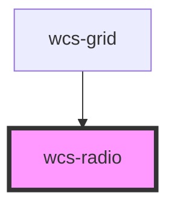

# wcs-radio

<!-- Auto Generated Below -->

## Properties

| Property   | Attribute  | Description                                         | Type                  | Default     |
| ---------- | ---------- | --------------------------------------------------- | --------------------- | ----------- |
| `checked`  | `checked`  | If `true`, the radio is selected.                   | `boolean`             | `false`     |
| `disabled` | `disabled` | If `true`, the user cannot interact with the radio. | `boolean`             | `false`     |
| `label`    | `label`    |                                                     | `string`              | `undefined` |
| `mode`     | `mode`     |                                                     | `"option" \| "radio"` | `'radio'`   |
| `value`    | `value`    |                                                     | `any`                 | `undefined` |

## Events

| Event           | Description | Type                            |
| --------------- | ----------- | ------------------------------- |
| `wcsRadioClick` |             | `CustomEvent<RadioChosedEvent>` |

## Dependencies

### Used by

 - [wcs-grid](../grid)

### Graph

----------------------------------------------

*Built with [StencilJS](https://stenciljs.com/)*
