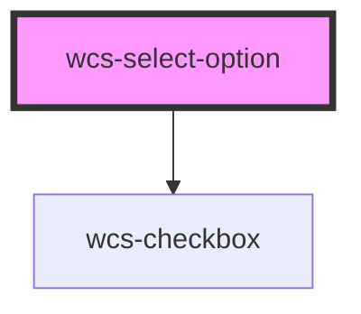

# Select option

<!-- Auto Generated Below -->

## Properties

| Property   | Attribute  | Description                                                     | Type      | Default     |
| ---------- | ---------- | --------------------------------------------------------------- | --------- | ----------- |
| `disabled` | `disabled` | Wether this option can be selected.                             | `boolean` | `false`     |
| `selected` | `selected` | Wether this option is selected.                                 | `boolean` | `false`     |
| `value`    | `value`    | The option value, not what's displayed, use inner text instead. | `any`     | `undefined` |

## Events

| Event                  | Description | Type                                   |
| ---------------------- | ----------- | -------------------------------------- |
| `wcsSelectOptionClick` |             | `CustomEvent<SelectOptionChosedEvent>` |

## Dependencies

### Depends on

- [wcs-checkbox](../checkbox)

### Graph

----------------------------------------------

*Built with [StencilJS](https://stenciljs.com/)*
