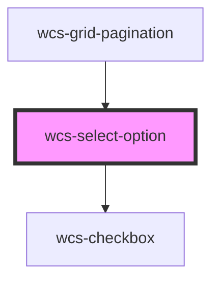

# Select option

<!-- Auto Generated Below -->

## Overview

Select option component, use in conjunction with wcs-select.

## Properties

| Property              | Attribute               | Description                                                     | Type      | Default     |
| --------------------- | ----------------------- | --------------------------------------------------------------- | --------- | ----------- |
| `chipBackgroundColor` | `chip-background-color` | Chip's background color.                                        | `string`  | `undefined` |
| `chipColor`           | `chip-color`            | Chip's displayed text color.                                    | `string`  | `undefined` |
| `disabled`            | `disabled`              | Wether this option can be selected.                             | `boolean` | `false`     |
| `selected`            | `selected`              | Wether this option is selected.                                 | `boolean` | `false`     |
| `value`               | `value`                 | The option value, not what's displayed, use inner text instead. | `any`     | `undefined` |

## Events

| Event                  | Description | Type                                   |
| ---------------------- | ----------- | -------------------------------------- |
| `wcsSelectOptionClick` |             | `CustomEvent<SelectOptionChosedEvent>` |

## Dependencies

### Used by

 - [wcs-grid-pagination](../grid-pagination)

### Depends on

- [wcs-checkbox](../checkbox)

### Graph

----------------------------------------------

*Built with [StencilJS](https://stenciljs.com/)*
