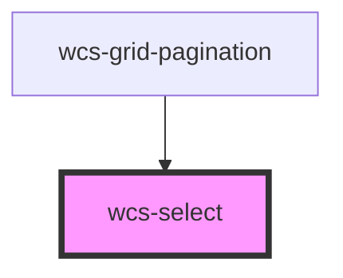

## TODO

- étudier la possibilité de mieux gérer la taille de l'overlay du select
  - utiliser la variable `--wcs-select-overlay-max-height` ?
  - on essaye de tout afficher, si pas possible on regarde s'il y a plus de place vers le haut
    si c'est le cas, on affiche l'overlay vers le haut avec le maximum d'option à l'écran
    sinon vers le bas, avec un maximum d'options à l'écran. Le plus simple est de faire ces calculs
    au moment du click pour déplier le select, comme c'est le cas actuellement ?

<!-- Auto Generated Below -->

## Overview

The select component (also named combobox) is a form component that allows users to select one or more options
from a list.
Use it with several slotted `wcs-select-option` inside.

## Properties

| Property       | Attribute      | Description                                                                                                                                                                     | Type                                                                | Default                                                               |
| -------------- | -------------- | ------------------------------------------------------------------------------------------------------------------------------------------------------------------------------- | ------------------------------------------------------------------- | --------------------------------------------------------------------- |
| `autocomplete` | `autocomplete` | If `true`, the select acts as an autocomplete field to filter your results.                                                                                                     | `boolean`                                                           | `false`                                                               |
| `chips`        | `chips`        | If `true`, selected items are shown in chips mode.                                                                                                                              | `boolean`                                                           | `false`                                                               |
| `compareWith`  | --             | Function used to compare options, default : deep comparison.                                                                                                                    | `(optionValue: any, selectedValue: any) => boolean`                 | `(optionValue, selectedValue) => isEqual(optionValue, selectedValue)` |
| `disabled`     | `disabled`     | If `true`, the user cannot interact with the select.                                                                                                                            | `boolean`                                                           | `false`                                                               |
| `filterFn`     | --             | Customizable sort function to change the comparison of values. If not provided, uses the default behavior : `option.textContent.toLowerCase().startsWith(filter.toLowerCase())` | `(optionEl: HTMLWcsSelectOptionElement, filter: string) => boolean` | `undefined`                                                           |
| `multiple`     | `multiple`     | If `true`, the user can select multiple values at once.                                                                                                                         | `boolean`                                                           | `false`                                                               |
| `name`         | `name`         | The name of the control, which is submitted with the form data.                                                                                                                 | `string`                                                            | `undefined`                                                           |
| `placeholder`  | `placeholder`  | The text to display when the select is empty.                                                                                                                                   | `string`                                                            | `undefined`                                                           |
| `size`         | `size`         | Specify the size (height) of the select.                                                                                                                                        | `"l" \| "m"`                                                        | `'m'`                                                                 |
| `value`        | `value`        | The currently selected value.                                                                                                                                                   | `any`                                                               | `undefined`                                                           |

## Events

| Event             | Description                                       | Type                                        |
| ----------------- | ------------------------------------------------- | ------------------------------------------- |
| `wcsBlur`         | Emitted when the select loses focus.              | `CustomEvent<void>`                         |
| `wcsChange`       | Emitted when the value has changed.               | `CustomEvent<SelectChangeEventDetail>`      |
| `wcsFilterChange` | Emitted when the autocomplete filter has changed. | `CustomEvent<SelectFilerChangeEventDetail>` |
| `wcsFocus`        | Emitted when the select has focus.                | `CustomEvent<void>`                         |

## Methods

### `close() => Promise<void>`

Close the component.

#### Returns

Type: `Promise<void>`

### `open() => Promise<void>`

Open the component.

#### Returns

Type: `Promise<void>`

### `setAriaAttribute(attr: AriaAttributeName, value: string) => Promise<void>`

#### Parameters

| Name    | Type                         | Description |
| ------- | ---------------------------- | ----------- |
| `attr`  | `"role" \| `aria-${string}`` |             |
| `value` | `string`                     |             |

#### Returns

Type: `Promise<void>`

## Slots

| Slot                                                                                           | Description |
| ---------------------------------------------------------------------------------------------- | ----------- |
| `"filter-no-result Contains the customizable "No result found" div (autocomplete mode only)."` |             |

## Dependencies

### Used by

 - [wcs-grid-pagination](../grid-pagination)

### Graph

----------------------------------------------

*Built with [StencilJS](https://stenciljs.com/)*
