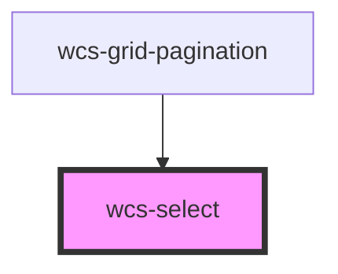

# Select

## Basic

```html
<wcs-select placeholder="Le select" id="leselectg">
    <wcs-select-option value="1">One</wcs-select-option>
    <wcs-select-option value="2">Two</wcs-select-option>
    <wcs-select-option value="3">Three</wcs-select-option>
</wcs-select>
```

## Basic object

```html
<wcs-select id="basic-object">
    <wcs-select-option id="basic-object-opt1">One</wcs-select-option>
    <wcs-select-option id="basic-object-opt2">Two</wcs-select-option>
    <wcs-select-option id="basic-object-opt3">Three</wcs-select-option>
</wcs-select>

<script>
    document.querySelector('#basic-object-opt1').value = {id: 1, label: 'label'};
    document.querySelector('#basic-object-opt2').value = {id: 2, label: 'label'};
    document.querySelector('#basic-object-opt3').value = {id: 3, label: 'label'};
    const pSelect = document.querySelector('#basic-object');
    pSelect.value = {id: 2, label: 'label'};
</script>
```

## With disabled option

```html
<wcs-select placeholder="Le select">
    <wcs-select-option value="1" disabled="true">One</wcs-select-option>
    <wcs-select-option value="2">Two</wcs-select-option>
    <wcs-select-option value="3">Three</wcs-select-option>
<wcs-select-option value="2">Two</wcs-select-option>
    <wcs-select-option value="3">Three</wcs-select-option>
<wcs-select-option value="2">Two</wcs-select-option>
    <wcs-select-option value="3">Three</wcs-select-option>
<wcs-select-option value="2">Two</wcs-select-option>
    <wcs-select-option value="3">Three</wcs-select-option>
<wcs-select-option value="2">Two</wcs-select-option>
    <wcs-select-option value="3">Three</wcs-select-option>
<wcs-select-option value="2">Two</wcs-select-option>
    <wcs-select-option value="3">Three</wcs-select-option>
<wcs-select-option value="2">Two</wcs-select-option>
    <wcs-select-option value="3">Three</wcs-select-option>
<wcs-select-option value="2">Two</wcs-select-option>
    <wcs-select-option value="3">Three</wcs-select-option>
<wcs-select-option value="2">Two</wcs-select-option>
    <wcs-select-option value="3">Three</wcs-select-option>
<wcs-select-option value="2">Two</wcs-select-option>
    <wcs-select-option value="3">Three</wcs-select-option>
</wcs-select>
```

## Disabled

```html
<wcs-select placeholder="Le select" disabled>
    <wcs-select-option value="1">One</wcs-select-option>
    <wcs-select-option value="2">Two</wcs-select-option>
    <wcs-select-option value="3">Three</wcs-select-option>
</wcs-select>
```

## Multiple

```html
<wcs-select placeholder="Le select" multiple >
    <wcs-select-option value="1">One</wcs-select-option>
    <wcs-select-option value="2">Two</wcs-select-option>
    <wcs-select-option value="3">Three</wcs-select-option>
</wcs-select>
```

## Multiple object

```html
<wcs-select id="basic-object-multiple" multiple>
    <wcs-select-option id="basic-object-multiple-opt1">One</wcs-select-option>
    <wcs-select-option id="basic-object-multiple-opt2">Two</wcs-select-option>
    <wcs-select-option id="basic-object-multiple-opt3">Three</wcs-select-option>
</wcs-select>

<script>
    document.querySelector('#basic-object-multiple-opt1').value = {id: 1, label: 'label'};
    document.querySelector('#basic-object-multiple-opt2').value = {id: 2, label: 'label'};
    document.querySelector('#basic-object-multiple-opt3').value = {id: 3, label: 'label'};
    const pSelectMultiple = document.querySelector('#basic-object-multiple');
    pSelectMultiple.value = [{id: 2, label: 'label'}, {id: 3, label: 'label'}];
</script>
```

## Multiple with chips mode

```html
<wcs-select placeholder="Le select" multiple chips>
    <wcs-select-option value="1">One</wcs-select-option>
    <wcs-select-option value="2" chip-background-color="blue">Two</wcs-select-option>
    <wcs-select-option id="chipRed" value="3">Three</wcs-select-option>
    <wcs-select-option value="4" chip-color="black" chip-background-color="#FAF025FF">Four</wcs-select-option>
</wcs-select>

<script>
    const option = document.querySelector('#chipRed');
    option.chipBackgroundColor = getComputedStyle(option).getPropertyValue('--wcs-red');
</script>
```

## Multiple with chips mode disabled

```html
<wcs-select id="chipsDisabled" placeholder="Le select" multiple chips disabled>
    <wcs-select-option value="1">One</wcs-select-option>
    <wcs-select-option value="2">Two</wcs-select-option>
    <wcs-select-option value="3">Three</wcs-select-option>
    <wcs-select-option value="4">Four</wcs-select-option>
</wcs-select>

<script>
    const pChipsDisabled = document.querySelector('#chipsDisabled');
    pChipsDisabled.value = ['2', '3'];
</script>
```

## Programatically select values

```html
<wcs-select id="select-values" placeholder="Le select" multiple>
    <wcs-select-option value="1">One</wcs-select-option>
    <wcs-select-option value="2">Two</wcs-select-option>
    <wcs-select-option value="3">Three</wcs-select-option>
</wcs-select>

<wcs-button id="p-sel-button" mode="stroked" class="primary">Select values</wcs-button>
<script>
    const pSelect = document.querySelector('#select-values');
    const pButton = document.querySelector('#p-sel-button');
    pButton.addEventListener('click', () => {
        pSelect.value = ['1', '2'];
    });
</script>
```

## Initial select values

```html
<wcs-select placeholder="Le select" value="1, 2" multiple>
    <wcs-select-option value="1">One</wcs-select-option>
    <wcs-select-option value="2">Two</wcs-select-option>
    <wcs-select-option value="3">Three</wcs-select-option>
</wcs-select>
```

## Lazy loaded options

```html
<wcs-select id="lazy-loaded-select" placeholder="Le select" multiple>
    <wcs-select-option value="1">One</wcs-select-option>
    <wcs-select-option value="2">Two</wcs-select-option>
    <wcs-select-option value="3">Three</wcs-select-option>
</wcs-select>

<wcs-button id="lazy-loaded-sel-button" mode="stroked" class="primary">Add option</wcs-button>

<script>
    const lazyLoadedSelect = document.querySelector('#lazy-loaded-select');
    const button = document.querySelector('#lazy-loaded-sel-button');
    let id = 3;
    lazyLoadedSelect.value = 4;
    button.addEventListener('click', () => {
        const opt = document.createElement('wcs-select-option');
        //opt.setAttribute('value', ++id);
        opt.value = ++id;
        opt.appendChild(document.createTextNode(id.toString()));
        lazyLoadedSelect.appendChild(opt);
        //lazyLoadedSelect.value=id;
    });
</script>
```

## Known issues

It is strongly recommended to add a width size to the select.

```html
<style>
    #lazy-loaded-select {
        width: 200px;
        margin-right: 16px;
        display: inline-block;
    }
</style>
```


<!-- Auto Generated Below -->


## Properties

| Property      | Attribute     | Description                                                     | Type      | Default     |
| ------------- | ------------- | --------------------------------------------------------------- | --------- | ----------- |
| `chips`       | `chips`       | If `true`, selected items are shown in chips mode.              | `boolean` | `false`     |
| `disabled`    | `disabled`    | If `true`, the user cannot interact with the select.            | `boolean` | `false`     |
| `multiple`    | `multiple`    | If `true`, the user can select multiple values at once.         | `boolean` | `false`     |
| `name`        | `name`        | The name of the control, which is submitted with the form data. | `string`  | `undefined` |
| `placeholder` | `placeholder` | The text to display when the select is empty.                   | `string`  | `undefined` |
| `value`       | `value`       | The currently selected value.                                   | `any`     | `undefined` |


## Events

| Event       | Description                          | Type                                   |
| ----------- | ------------------------------------ | -------------------------------------- |
| `wcsBlur`   | Emitted when the select loses focus. | `CustomEvent<void>`                    |
| `wcsChange` | Emitted when the value has changed.  | `CustomEvent<SelectChangeEventDetail>` |
| `wcsFocus`  | Emitted when the select has focus.   | `CustomEvent<void>`                    |


## Methods

### `close() => Promise<void>`

Close the component.

#### Returns

Type: `Promise<void>`


### `open() => Promise<void>`

Open the component.

#### Returns

Type: `Promise<void>`


## Dependencies

### Used by

 - [wcs-grid-pagination](../grid-pagination)

### Graph


----------------------------------------------

*Built with [StencilJS](https://stenciljs.com/)*
