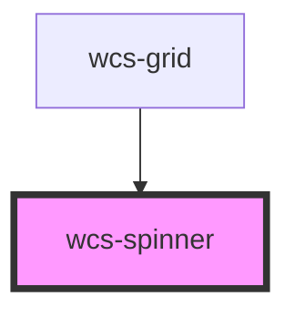

# Spinner

## Basic

```html
<wcs-spinner class="wcs-primary"></wcs-spinner>
<wcs-spinner class="wcs-secondary"></wcs-spinner>
<wcs-spinner class="wcs-success"></wcs-spinner>
<wcs-spinner class="wcs-warning"></wcs-spinner>
<wcs-spinner class="wcs-danger"></wcs-spinner>
<wcs-spinner class="wcs-info"></wcs-spinner>
<wcs-spinner class="wcs-dark"></wcs-spinner>
<wcs-spinner class="wcs-light"></wcs-spinner>
```

## Growing spinner

```html
<wcs-spinner mode="growing" class="wcs-primary"></wcs-spinner>
<wcs-spinner mode="growing" class="wcs-secondary"></wcs-spinner>
<wcs-spinner mode="growing" class="wcs-success"></wcs-spinner>
<wcs-spinner mode="growing" class="wcs-warning"></wcs-spinner>
<wcs-spinner mode="growing" class="wcs-danger"></wcs-spinner>
<wcs-spinner mode="growing" class="wcs-info"></wcs-spinner>
<wcs-spinner mode="growing" class="wcs-dark"></wcs-spinner>
<wcs-spinner mode="growing" class="wcs-light"></wcs-spinner>
```

<style>
    wcs-spinner {
        margin: 8px;
    }
</style>

<!-- Auto Generated Below -->


## Properties

| Property | Attribute | Description                                                                | Type                    | Default    |
| -------- | --------- | -------------------------------------------------------------------------- | ----------------------- | ---------- |
| `mode`   | `mode`    | Indicates the spinner display mode. Accepted values: `border` or `growing` | `"border" \| "growing"` | `'border'` |


## Dependencies

### Used by

 - [wcs-grid](../grid)

### Graph


----------------------------------------------

*Built with [StencilJS](https://stenciljs.com/)*
